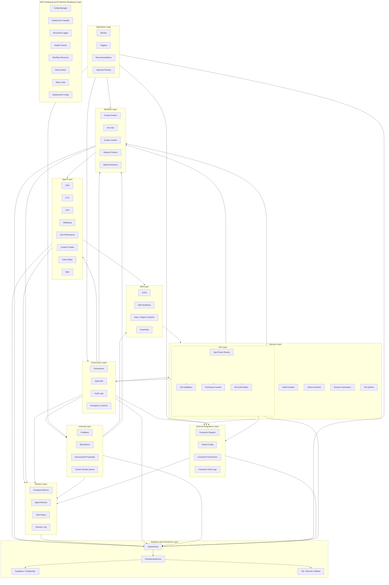

# SYSTEM_ARCHITECTURE

AI Company OS is an AI-native operating system for running a company with specialized agents, operational skills, real execution harnesses, shared memory, and repeatable workflows.

This reset separates the system into explicit operating layers. Existing `src`, `docs`, and `supabase` files remain in place for compatibility. The new canonical operating structure starts in `company-os/`.

## Current Structure Audit

Current project assets:

- `src/app`: Next.js pages and API routes
- `src/modules`: feature-oriented modules for agents, tasks, memory, workflows, communications, SOP, skills
- `docs`: previous architecture documents and planning memory
- `supabase/migrations`: current database schema and RLS migrations
- Root docs: project rules, status, roadmap, company structure

Current issue:

- Agents, skills, tools, memory, and workflows exist as mixed feature modules.
- Skills are not consistently separated from runtime tools.
- Agent definitions are code-centric, not operationally documented.
- Workflow docs exist, but the company operating model is not yet the organizing structure.

## Target Architecture

## Layer Responsibilities

### Agent Layer

Defines who does the work.

Each agent has:

- Role and business responsibility
- Decision authority
- Required skills
- Memory access scope
- Collaboration rules
- Escalation path

Canonical path:

- `company-os/agents/<agent-id>/AGENT.md`
- `company-os/agents/<agent-id>/SKILLS.md`

### Skill Layer

Defines how work should be done.

A skill is not just a prompt. A skill is an operational manual containing:

- SOP
- Workflow
- Required inputs
- Expected outputs
- Quality checklist
- Guardrails
- Failure/escalation rules

Canonical path:

- `company-os/skills/README.md`
- agent-owned skills remain documented in each agent `SKILLS.md`

### Harness Layer

Defines what tools can actually execute work.

Harness is separate from skill:

- Skill: instruction/manual
- Harness: runtime/tool capability

Harness examples:

- Node runtime
- Python runtime
- Browser automation
- File system
- Supabase/Postgres
- External API connectors

Canonical path:

- `company-os/harness/README.md`

### Memory Layer

Defines what the company remembers.

Memory categories:

- Company memory
- Agent memory
- Task history
- Decision log
- Workflow lessons
- SOP improvements

Canonical path:

- `company-os/memory/README.md`

### Workflow Layer

Defines repeatable company operations.

Workflow examples:

- Create product
- Run ads
- Create content
- Analyze finance
- Research market

Canonical path:

- `company-os/workflows/README.md`

### Governance Layer

Defines what agents are allowed to do and when humans must supervise.

Governance responsibilities:

- Agent permissions
- Role-based workflow and harness access
- Approval checkpoints
- Approval hierarchy
- Audit logging
- Emergency stop and resume controls

Canonical path:

- `governance`
- `docs/human-oversight-governance-layer.md`

### Learning Layer

Defines how agents improve through controlled reviewable feedback loops.

Learning responsibilities:

- Feedback processing
- Execution analysis
- Skill performance scoring
- SOP refinement proposals
- Memory refinement suggestions
- Human review queue
- Learning audit logs

Canonical path:

- `learning`
- `docs/self-improving-learning-system.md`

### Operations Layer

Defines proactive but supervised company operations.

Operations responsibilities:

- Company status monitoring
- Scheduled operations
- Event-driven triggers
- Risk and opportunity detection
- Recommendation ranking
- Approval routing for high-impact actions
- Operations logs

Canonical path:

- `operations`
- `workflows/weekly-company-review/WORKFLOW.md`
- `docs/autonomous-operations-layer.md`

### External Integrations Layer

Defines safe boundaries for real business tools.

Integration responsibilities:

- Connector registry and provider metadata
- OAuth-ready configuration stubs
- Read/write/external action contracts
- Connector permission validation
- Rate limit preparation
- Connector error normalization
- Connector audit logs
- Approval-gated external actions

Canonical path:

- `integrations`
- `docs/external-integrations-layer.md`
- `src/modules/agent-runtime/integrations`

### Database and Persistence Layer

Defines durable storage and migration-safe repositories.

Persistence responsibilities:

- Supabase/PostgreSQL schema and indexes
- Typed repository pattern
- In-memory fallback when env vars are missing
- File-to-database migration bridge
- pgvector-ready memory fields
- Artifact metadata
- Dashboard retrieval preparation

Canonical path:

- `src/database`
- `docs/DATABASE_ARCHITECTURE.md`
- `docs/PERSISTENCE_MIGRATION_PLAN.md`

### API Layer

Defines the official backend interface.

API responsibilities:

- Route validation
- Centralized JSON responses and errors
- Permission-aware route guards
- Audit logging for important actions
- Repository-backed data access
- Safe fallback when database env is missing
- Dashboard read endpoints

Canonical path:

- `src/server/api`
- `src/app/api`
- `docs/API_ARCHITECTURE.md`
- `docs/API_ENDPOINTS.md`

### MVP Hardening and Production Readiness Layer

Defines the reliability boundary for a production-safe MVP.

Production readiness responsibilities:

- centralize environment configuration
- validate development, staging, and production settings
- normalize structured runtime errors
- log runtime, workflow, governance, and integration events
- expose system health and workflow health
- rate-limit APIs, connectors, workflows, and agents
- queue retries and recover failed workflows from checkpoints
- provide Docker, Vercel, and Supabase deployment guidance

Canonical files:

- `src/infrastructure`
- `config/development.env.example`
- `config/production.env.example`
- `docker`
- `docs/PRODUCTION_READINESS.md`
- `docs/MVP_DEPLOYMENT_GUIDE.md`
- `docs/OBSERVABILITY_GUIDE.md`
- `docs/RECOVERY_STRATEGY.md`

## Migration Plan

Safe migration means no existing file is deleted.

### Phase 1: Add Canonical Operating Structure

Status: started in this reset.

- Add `company-os/agents`
- Add `company-os/skills`
- Add `company-os/harness`
- Add `company-os/memory`
- Add `company-os/workflows`
- Add agent `AGENT.md` and `SKILLS.md` files
- Replace root docs with architecture direction while preserving old implementation files

### Phase 2: Map Existing Code To New Layers

Map current modules:

- `src/modules/agents` -> Agent Layer implementation
- `src/modules/skills` -> Skill Layer registry and progression
- `src/modules/integrations` -> Harness Layer connectors
- `src/modules/memory` -> Memory Layer repositories and retrieval
- `src/modules/workflows` -> Workflow Layer runtime
- `src/modules/tasks` -> Workflow/task execution bridge
- `src/modules/communications` -> Agent collaboration bus
- `src/modules/agent-runtime/governance` -> Governance Layer runtime
- `src/modules/agent-runtime/learning` -> Learning Layer runtime
- `src/modules/agent-runtime/operations` -> Operations Layer runtime
- `src/modules/agent-runtime/integrations` -> External Integrations Layer runtime
- `src/database` -> Database and Persistence Layer runtime
- `src/server/api` and `src/app/api` -> API Layer runtime
- `src/infrastructure` -> MVP Hardening and Production Readiness runtime

### Phase 3: Add Layer Interfaces

Create TypeScript contracts:

- `AgentDefinition`
- `SkillDefinition`
- `HarnessCapability`
- `MemoryRecord`
- `WorkflowDefinition`
- `GovernancePolicy`
- `LearningProposal`
- `OperationRun`

### Phase 4: Refactor Without Breaking Routes

Keep existing UI/API routes working while internally reading from the new layer contracts.

### Phase 5: Runtime Integration

Wire:

- Agent -> Skill
- Skill -> Harness
- Workflow -> Agent
- Agent -> Memory
- Workflow outcome -> Memory
- Governance -> workflow, harness, memory, and collaboration checkpoints
- Learning -> feedback, metrics, proposals, human review, and audited approved changes
- Operations -> monitor, trigger, recommend, route approval, and log proactive work
- External integrations -> validate connector permissions, require approval for writes/external actions, log audit records, and return stub-safe outputs until real OAuth/API support is approved
- Database -> persist layer state through repositories while keeping file fallback intact
- API -> validate requests, apply governance, call repositories/runtime modules, and audit important actions
- Production readiness -> validate environment, structure errors/logs, check health, rate-limit execution, and recover failed workflows

## Non-Goals For This Reset

- Do not add new product features.
- Do not delete previous docs or modules.
- Do not pretend tools exist unless harness support is explicit.
- Do not make agents into generic chatbots.

## Source Of Truth

The architecture source of truth is now:

- `SYSTEM_ARCHITECTURE.md`
- `COMPANY_STRUCTURE.md`
- `company-os/agents/*/AGENT.md`
- `company-os/agents/*/SKILLS.md`
- `company-os/harness/README.md`
- `company-os/memory/README.md`
- `company-os/workflows/README.md`
- `governance/*.md`
- `learning/*.md`
- `operations/*.md`
- `integrations/*.md`
- `docs/DATABASE_ARCHITECTURE.md`
- `docs/PERSISTENCE_MIGRATION_PLAN.md`
- `docs/API_ARCHITECTURE.md`
- `docs/API_ENDPOINTS.md`
