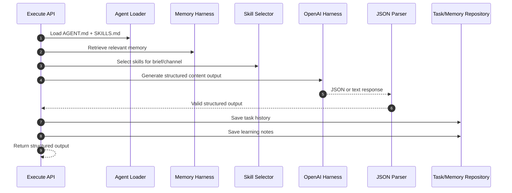

# Content Creator Agent Architecture

This is the first production-ready agent implementation target for AI Company OS.

## Purpose

Prove that the layered architecture works:

- Agent Layer: `AGENT.md`
- Skill Layer: `SKILLS.md`
- Harness Layer: OpenAI, file system, memory retrieval, web search abstraction, JSON parser
- Memory Layer: company memory, task history, learning notes
- Workflow Layer: content brief execution pipeline

## Runtime Flow

## Execution Contract

Input:

- organizationId
- brief
- productName
- targetAudience
- channel
- contentGoal
- tone
- constraints

Output:

- selected skills
- memory context
- hooks
- content concepts
- scripts
- captions
- CTA variants
- guardrail report
- task history status
- learning note status

## Production Rules

- If OpenAI API is unavailable, return deterministic fallback and mark harness status.
- Do not publish externally.
- Save task history and learning notes when Supabase is configured.
- Do not make unsupported claims.
- Return structured output only.
