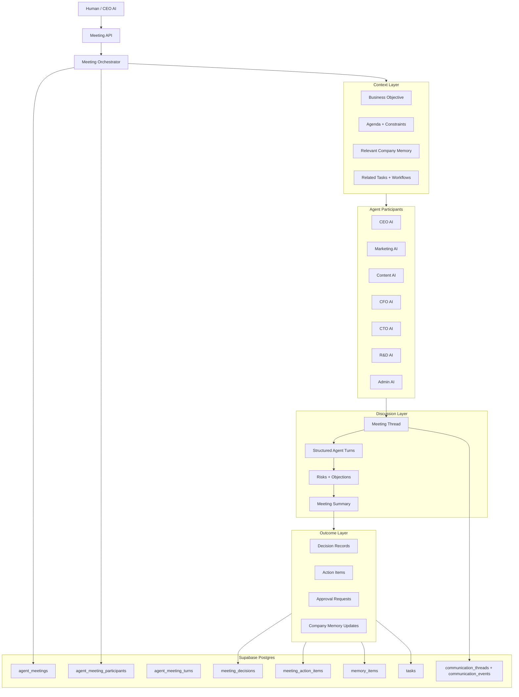
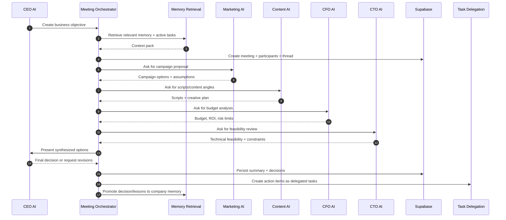

# AI Agent Meeting System

The AI Agent Meeting System lets multiple business agents discuss a shared objective, challenge each other from their domain expertise, make traceable decisions, produce action items, and update company memory.

Example flow:

- CEO AI creates a business goal
- Marketing AI proposes campaign strategy
- Content AI proposes scripts and content angles
- CFO AI analyzes budget and expected return
- CTO AI evaluates technical feasibility and implementation risk

This is not a chat room. It is an operating ritual for the AI company: objective in, structured discussion, decisions out, actions delegated, memory updated.

## Architecture



## Core Concepts

### Meeting

A meeting is a structured collaboration session around a business objective.

Recommended fields:

- `organization_id`
- `created_by_agent_id`
- `objective`
- `meeting_type`: `strategy`, `campaign_planning`, `budget_review`, `product_decision`, `crisis_response`, `retrospective`
- `status`: `draft`, `running`, `waiting_for_approval`, `completed`, `cancelled`
- `context_snapshot`: frozen input context used at meeting start
- `summary`: final meeting summary
- `started_at`, `completed_at`

### Participant

Each participant has a role in the meeting, not just an agent identity.

Examples:

- CEO AI: chair, final synthesizer, business priority owner
- Marketing AI: market strategy and audience owner
- Content AI: content execution and creative feasibility owner
- CFO AI: budget, ROI, margin, and cash risk owner
- CTO AI: technical feasibility, automation, data, and integration owner

Recommended fields:

- `meeting_id`
- `agent_id`
- `meeting_role`
- `speaking_order`
- `required_output`
- `status`: `invited`, `ready`, `contributed`, `blocked`

### Meeting Turn

Every agent contribution is stored as a structured turn.

Recommended fields:

- `meeting_id`
- `agent_id`
- `turn_type`: `proposal`, `analysis`, `critique`, `question`, `answer`, `decision_vote`, `summary`
- `content`
- `claims`
- `risks`
- `assumptions`
- `recommended_actions`
- `memory_references`

### Decision

Decisions are first-class records, not hidden inside a summary.

Recommended fields:

- `meeting_id`
- `decision`
- `rationale`
- `owner_agent_id`
- `confidence`
- `tradeoffs`
- `rejected_options`
- `requires_human_approval`
- `memory_item_id`

### Action Item

Action items are converted into tasks or workflow runs.

Recommended fields:

- `meeting_id`
- `decision_id`
- `title`
- `description`
- `owner_agent_id`
- `collaborator_agent_ids`
- `priority`
- `deadline_at`
- `status`
- `task_id`

## Memory Integration

The meeting system uses three memory layers.

### 1. Pre-Meeting Context Retrieval

Before agents speak, the orchestrator builds a context pack:

- Company facts from `memory_items`
- Prior decisions related to the objective
- Brand preferences and operating principles
- Recent reports and lessons learned
- Active tasks and unresolved blockers
- Relevant SOPs from `knowledge_documents`

The context pack should be saved in `agent_meetings.context_snapshot` so the meeting is auditable later.

### 2. In-Meeting Working Memory

During the meeting, the system maintains:

- Current objective
- Agenda step
- Speaker order
- Open questions
- Disagreements
- Proposed actions
- Pending approval points

This can live in LangGraph state for runtime execution and be periodically checkpointed to Supabase through meeting turns.

### 3. Post-Meeting Company Memory

After the final synthesis, the meeting writes long-term memory:

- `memory_type = decision` for approved strategic decisions
- `memory_type = lesson` for risks, objections, and useful retrospective insights
- `memory_type = preference` when the meeting reveals company preference or brand direction
- `memory_type = report_summary` for executive summaries
- `memory_type = sop_improvement` when process changes are recommended

Each memory item should include metadata:

```ts
{
  source: "agent_meeting",
  meetingId: string,
  decisionId?: string,
  participantAgentIds: string[],
  confidence: number,
  objective: string
}
```

## Discussion Flow



### Recommended Meeting Stages

1. Objective intake
   - CEO AI or human defines the business goal, success metric, deadline, and constraints.

2. Context assembly
   - Orchestrator retrieves memory, related tasks, prior decisions, SOPs, and active risks.

3. Participant briefing
   - Each agent receives the same objective plus role-specific instructions.

4. First proposal round
   - Marketing proposes strategy.
   - Content proposes execution assets.
   - CFO proposes financial guardrails.
   - CTO proposes feasibility guardrails.

5. Critique round
   - Each agent identifies risks in other proposals.
   - CEO AI asks follow-up questions where assumptions conflict.

6. Revision round
   - Agents update proposals based on critiques.

7. Synthesis
   - CEO AI summarizes options, tradeoffs, recommended decision, and open risks.

8. Decision recording
   - System writes explicit decision records and marks if human approval is required.

9. Action item generation
   - System converts agreed actions into tasks with owners, deadlines, and collaborators.

10. Memory promotion
   - System writes decisions, lessons, and company preferences into long-term memory.

## Agent Output Contracts

Each agent should return structured output so the meeting can be summarized and actioned.

```ts
type MarketingMeetingOutput = {
  campaignStrategy: string;
  targetAudience: string[];
  channels: string[];
  expectedImpact: string;
  assumptions: string[];
  risks: string[];
};

type ContentMeetingOutput = {
  contentAngles: string[];
  draftHooks: string[];
  scriptIdeas: string[];
  requiredAssets: string[];
  productionRisks: string[];
};

type CfoMeetingOutput = {
  budgetRange: string;
  costDrivers: string[];
  roiAssumptions: string[];
  financialRisks: string[];
  approvalThresholds: string[];
};

type CtoMeetingOutput = {
  feasibility: "low" | "medium" | "high";
  requiredSystems: string[];
  implementationRisks: string[];
  automationOpportunities: string[];
  blockers: string[];
};
```

## Implementation Plan

### Phase 1: Database Foundation

Add migration:

- `agent_meetings`
- `agent_meeting_participants`
- `agent_meeting_turns`
- `meeting_decisions`
- `meeting_action_items`

RLS:

- All tables include `organization_id`
- Members can read/write meeting records through `public.is_org_member(organization_id)`
- Meeting turns and decisions are immutable by default after completion, unless edited through a new audited revision mechanism

### Phase 2: Domain Module

Add `src/modules/meetings`:

- `types.ts`: meeting status, turn types, input/output contracts
- `meeting-orchestrator.ts`: deterministic MVP flow
- `context-builder.ts`: loads memory/tasks/SOP context
- `repository.ts`: Supabase persistence
- `summarizer.ts`: creates executive summary and decision candidates
- `action-item-generator.ts`: maps decisions to task delegation inputs
- `memory-promoter.ts`: writes selected outcomes to `memory_items`

### Phase 3: API Routes

Add routes:

- `POST /api/meetings`: create meeting from objective
- `POST /api/meetings/[id]/start`: retrieve context and start discussion
- `POST /api/meetings/[id]/turns`: append an agent turn
- `POST /api/meetings/[id]/summarize`: generate/update summary
- `POST /api/meetings/[id]/decisions`: record decision
- `POST /api/meetings/[id]/action-items`: create action items and delegated tasks
- `POST /api/meetings/[id]/complete`: finalize, promote memory, close meeting

### Phase 4: LangGraph Runtime

Create a meeting graph:

- `objective_intake`
- `context_retrieval`
- `participant_briefing`
- `proposal_round`
- `critique_round`
- `revision_round`
- `ceo_synthesis`
- `decision_recording`
- `task_generation`
- `memory_promotion`

The deterministic MVP can run without real LLM calls first. Later, each agent node calls the model provider using role prompts, memory context, and structured output validation.

### Phase 5: UI

Add `/meetings` control surface:

- Meeting list and status
- Create meeting form
- Objective/context panel
- Agent participant rail
- Timeline of meeting turns
- Decisions panel
- Action items panel
- Memory updates panel

The UI should feel like an executive war room, not a chat app: structured, decision-oriented, and optimized for scanning.

### Phase 6: Automation

Add scheduled and event-triggered meetings:

- Weekly CEO planning meeting
- Campaign planning meeting when Marketing AI creates a campaign goal
- Budget review meeting when CFO detects high spend
- Incident meeting when CTO flags a blocker
- Retrospective meeting after major task/workflow completion

## MVP Scope

The first useful MVP should support:

- Create meeting objective
- Select participant agent roles
- Build context pack from existing memory and tasks
- Store structured meeting turns
- Generate meeting summary
- Record decisions
- Create action items as tasks
- Promote final decision and summary to memory

## Success Criteria

The meeting system is working when:

- A business objective can become a structured multi-agent discussion
- Every agent contribution is stored and attributable
- The final summary lists decisions, risks, assumptions, and tradeoffs
- Decisions become memory
- Action items become delegated tasks
- Future meetings can retrieve prior meeting outcomes as context
