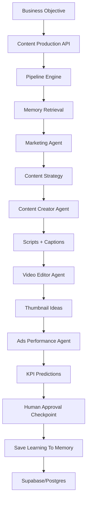

# AI Content Production Pipeline

This is the first real autonomous workflow under the reset AI Company OS architecture.

## Architecture

## Backend Logic

The deterministic MVP does not call a real LLM yet. It executes a structured pipeline:

1. Normalize the business objective.
2. Retrieve relevant sample/company memory.
3. Generate audience analysis.
4. Generate content strategy.
5. Generate content ideas.
6. Generate scripts.
7. Generate captions.
8. Generate thumbnail ideas.
9. Generate posting schedule.
10. Generate KPI predictions.
11. Mark the run as waiting for human approval.
12. Prepare learning memory candidate.

## Database Schema

Added in `supabase/migrations/202605070008_ai_content_production_pipeline.sql`:

- `content_pipeline_runs`
- `content_pipeline_artifacts`
- `content_pipeline_analytics`
- `content_pipeline_learning_events`

## API Endpoints

- `POST /api/workflows/content-production/start`
- `POST /api/workflows/content-production/[id]/approve`

## Frontend UI

The UI at `/workflows/content-production` provides:

- Business objective form
- Target audience and channel inputs
- Live deterministic pipeline start
- Workflow state overview
- Agent collaboration map
- Artifact preview
- KPI prediction panel
- Approval checkpoint state
- Memory learning preview
