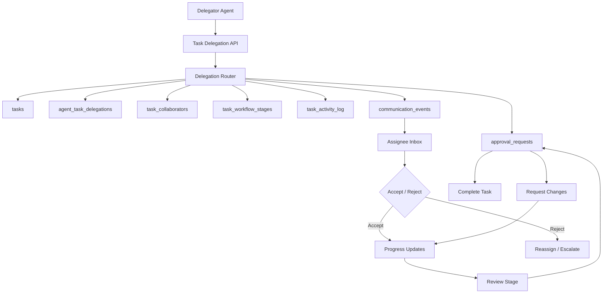

# AI Task Delegation System

ระบบนี้ทำให้ AI agents ทำงานเหมือนบริษัทจริง: มอบหมายงาน, รับ/ปฏิเสธงาน, ทำงานร่วมกันหลาย Agent, ขออนุมัติ, ติดตาม progress, เก็บ history และผูกกับ workflow stages

## Architecture

## Database Design

Existing foundation:

- `tasks`: core task record
- `agent_task_delegations`: task assignment from one Agent to another
- `approval_requests`: formal approval flow
- `task_events`: simple task timeline
- `communication_events`: async event queue and realtime source
- `workflow_runs`, `workflow_steps`: workflow engine

New additions:

- `task_workflow_stages`: stage templates per organization/workflow type
- `task_stage_transitions`: allowed stage movement
- `task_collaborators`: multi-agent collaboration roles on a task
- `task_progress_updates`: percent progress, blockers, next action
- `task_activity_log`: audit-grade history timeline
- `task_acceptance_decisions`: accept/reject records with reasons
- `task_approval_decisions`: approval decision history

## Agent Interaction Flow

1. Delegator Agent creates a task or selects an existing task
2. Delegator calls `POST /api/tasks/delegations`
3. Router creates delegation, inbox event, task collaborators, and activity log
4. Assignee Agent receives realtime notification
5. Assignee calls accept/reject endpoint
6. Accepted task moves to active stage; rejected task returns to delegator or escalates
7. Agent sends progress updates during execution
8. Review/approval stage creates approval request
9. Approval decision completes, rejects, or requests changes
10. Every action writes to task history

## Workflow Logic

Task stages:

- `intake`: task created and scoped
- `assigned`: task delegated to Agent
- `accepted`: Agent accepted ownership
- `in_progress`: Agent actively working
- `review`: output ready for review
- `approval`: waiting for approval
- `completed`: accepted and closed
- `blocked`: cannot proceed
- `cancelled`: no longer active

Rules:

- Only assigned Agent can accept/reject delegation
- Critical tasks require approval before completion
- Blocked tasks create escalation candidate
- Multi-agent tasks require at least one owner and may include collaborators/reviewers
- Stage transitions always create `task_activity_log`

## APIs

- `POST /api/tasks/delegations`: create delegation
- `POST /api/tasks/delegations/[id]/accept`: accept delegation
- `POST /api/tasks/delegations/[id]/reject`: reject delegation
- `POST /api/tasks/[id]/progress`: add progress update
- `POST /api/tasks/[id]/approval`: request approval
- `POST /api/tasks/approvals/[id]/decision`: approve/reject/request changes

## UI Components

- `TaskDelegationBoard`: executive task management screen
- `DelegationPipeline`: stage pipeline visualization
- `TaskDelegationCard`: assignment card with priority/deadline/progress
- `AgentAssignmentPanel`: agent owner/collaborator view
- `TaskHistoryTimeline`: audit timeline
- `ApprovalQueuePanel`: pending approvals

## Production Notes

- Supabase Realtime should subscribe to `agent_task_delegations`, `task_progress_updates`, `approval_requests`, and `communication_events`
- Long-running task execution should move to a background worker
- LangGraph nodes should emit delegation events and pause on approval nodes
- RLS remains organization-scoped through `public.is_org_member(organization_id)`
