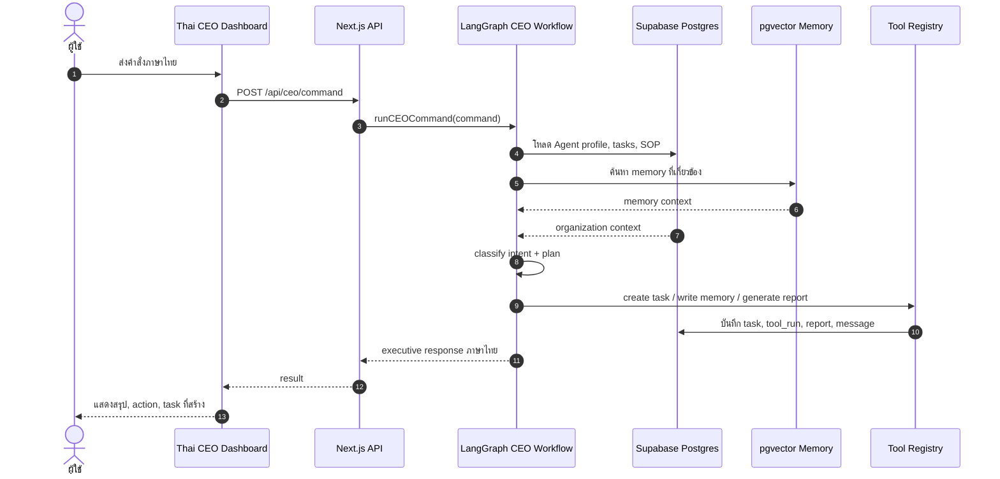
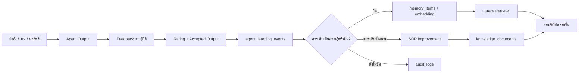
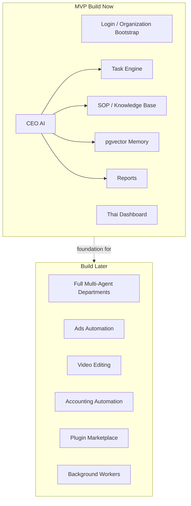

# AI Company OS Complete Architecture Diagram

แผนภาพนี้คือ architecture ระดับระบบของ AI Company OS สำหรับ MVP และเส้นทางขยายเป็น multi-agent company workforce

```mermaid
flowchart TB
  user["ผู้ใช้คนไทย / ผู้บริหาร"] --> web["Next.js Web App<br/>Thai UI + App Router"]

  subgraph frontend["Frontend Layer"]
    web --> shell["Dashboard Shell"]
    shell --> command["ศูนย์บัญชาการ CEO"]
    shell --> agentsUi["หน้า Agent Management"]
    shell --> tasksUi["หน้า Task Board"]
    shell --> memoryUi["หน้า Memory"]
    shell --> sopUi["หน้า SOP / Knowledge Base"]
    shell --> reportsUi["หน้า Reports"]
  end

  subgraph backend["Backend/API Layer - Next.js"]
    command --> ceoApi["POST /api/ceo/command"]
    agentsUi --> agentsApi["Agent APIs"]
    tasksUi --> tasksApi["Task APIs"]
    memoryUi --> memoryApi["Memory APIs"]
    sopUi --> sopApi["SOP APIs"]
    reportsUi --> reportsApi["Report APIs"]
  end

  subgraph orchestration["AI Orchestration Layer - LangGraph TS"]
    ceoApi --> ceoGraph["CEO AI Supervisor Graph"]
    ceoGraph --> intentNode["Intent Classification"]
    intentNode --> contextNode["Context Loader<br/>Agent + Tasks + SOP + Memory"]
    contextNode --> planningNode["Planning / Task Decomposition"]
    planningNode --> toolNode["Tool Execution Router"]
    toolNode --> responseNode["Thai Executive Response"]
  end

  subgraph tools["Internal Tool Registry"]
    toolNode --> createTaskTool["Create Task"]
    toolNode --> writeMemoryTool["Write Memory"]
    toolNode --> generateReportTool["Generate Report"]
    toolNode --> sopSearchTool["Search SOP"]
    toolNode --> delegateTool["Delegate To Agent<br/>Future"]
  end

  subgraph data["Supabase Data Layer"]
    auth["Supabase Auth"]
    postgres["Postgres + RLS"]
    vector["pgvector Memory Index"]
    storage["Supabase Storage<br/>Future Docs/Media"]
  end

  web --> auth
  agentsApi --> postgres
  tasksApi --> postgres
  memoryApi --> postgres
  sopApi --> postgres
  reportsApi --> postgres

  createTaskTool --> tasksTable["tasks"]
  writeMemoryTool --> memoryTable["memory_items"]
  generateReportTool --> reportsTable["reports"]
  sopSearchTool --> docsTable["knowledge_documents"]

  tasksTable --> postgres
  reportsTable --> postgres
  docsTable --> postgres
  memoryTable --> postgres
  memoryTable --> vector

  subgraph schema["Core Database Schema"]
    orgs["organizations"]
    profiles["profiles"]
    memberships["memberships"]
    departments["departments"]
    agents["agents"]
    skills["agent_skills"]
    sops["agent_sops"]
    docs["knowledge_documents"]
    memory["memory_items"]
    threads["conversation_threads"]
    messages["messages"]
    tasks["tasks"]
    workflows["workflows"]
    workflowRuns["workflow_runs"]
    toolRuns["tool_runs"]
    feedback["agent_feedback"]
    learning["agent_learning_events"]
    reports["reports"]
    audit["audit_logs"]
  end

  postgres --> orgs
  postgres --> profiles
  postgres --> memberships
  postgres --> departments
  postgres --> agents
  postgres --> skills
  postgres --> sops
  postgres --> docs
  postgres --> memory
  postgres --> threads
  postgres --> messages
  postgres --> tasks
  postgres --> workflows
  postgres --> workflowRuns
  postgres --> toolRuns
  postgres --> feedback
  postgres --> learning
  postgres --> reports
  postgres --> audit

  subgraph learningLoop["Agent Learning Loop"]
    output["Agent Output"] --> humanFeedback["Human Feedback"]
    humanFeedback --> feedback
    feedback --> learning
    learning --> memoryPromotion["Memory Promotion"]
    learning --> sopImprovement["SOP Improvement Suggestion"]
    memoryPromotion --> memory
    sopImprovement --> docs
  end

  responseNode --> output

  subgraph futureAgents["Future Multi-Agent Workforce"]
    ceo["CEO AI"]
    cto["CTO AI"]
    cfo["CFO AI"]
    marketing["Marketing AI"]
    content["Content Creator AI"]
    video["Video Editor AI"]
    rd["R&D AI"]
    ads["Ads Performance AI"]
    support["Customer Support AI"]
    admin["Admin / Account AI"]
  end

  delegateTool -. future routing .-> ceo
  ceo -. delegates .-> cto
  ceo -. delegates .-> cfo
  ceo -. delegates .-> marketing
  ceo -. delegates .-> content
  ceo -. delegates .-> video
  ceo -. delegates .-> rd
  ceo -. delegates .-> ads
  ceo -. delegates .-> support
  ceo -. delegates .-> admin

  subgraph deployment["Deployment"]
    vercel["Vercel<br/>Next.js App + API"]
    supabase["Supabase Cloud<br/>Auth + DB + Vector"]
    observability["Logs / Monitoring / Eval Tests"]
  end

  web --> vercel
  backend --> vercel
  data --> supabase
  orchestration --> observability
  tools --> observability
```

## System Flow

## Memory And Learning Flow

## MVP Boundary

