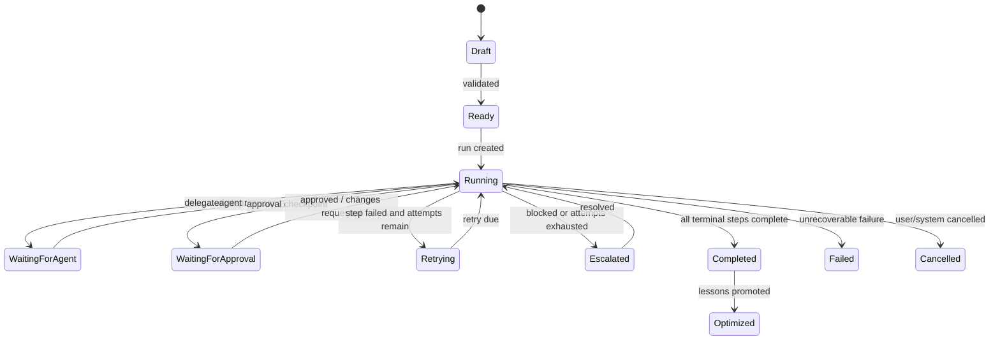

# Autonomous Workflow Engine

The Autonomous Workflow Engine is the execution core of AI Company OS. It turns business objectives into multi-agent workflows that can plan, delegate, execute, branch, pause for approval, retry failures, escalate problems, and learn from outcomes.

The system should behave like an autonomous AI-powered company: objectives come in, agents break them down, departments collaborate asynchronously, results are tracked, and reusable lessons are written back to organizational memory.

## 1. Workflow Architecture

```mermaid
flowchart TB
  objective["Business Objective"] --> planner["Objective Planner"]
  planner --> definition["Workflow Definition"]
  definition --> engine["Workflow Execution Engine"]

  subgraph orchestration["Orchestration Layer"]
    graph["LangGraph Adapter"]
    scheduler["Scheduler"]
    events["Event Router"]
    approval["Approval Gate"]
    retry["Retry Manager"]
    escalation["Escalation Manager"]
  end

  subgraph collaboration["Agent Collaboration"]
    ceo["CEO AI"]
    marketing["Marketing AI"]
    content["Content AI"]
    video["Video AI"]
    ads["Ads AI"]
    cfo["CFO AI"]
    cto["CTO AI"]
  end

  subgraph data["Supabase + PostgreSQL"]
    workflows["workflows"]
    steps["workflow_steps + edges"]
    runs["workflow_runs"]
    runSteps["workflow_run_steps"]
    eventsTable["workflow_run_events"]
    tasks["tasks + delegations"]
    approvals["approval_requests"]
    memory["memory_items + retrieval"]
  end

  engine --> orchestration
  orchestration --> collaboration
  collaboration --> tasks
  engine --> data
  memory --> engine
  events --> engine
```

Core layers:

- Workflow definition layer: stores graph structure, step config, triggers, retry policy, and approval rules
- Execution layer: creates workflow runs, moves steps through lifecycle, evaluates conditions, and persists state
- Agent orchestration layer: maps steps to agent roles, tasks, tools, approvals, reports, and memory writes
- Event layer: resumes workflows from external events, task progress, approvals, schedules, and realtime messages
- Memory layer: retrieves context before execution and writes lessons after completion
- Monitoring layer: exposes timeline, run status, step state, retries, escalations, and KPIs

## 2. Database Schema

Existing tables stay as foundation:

- `workflows`
- `workflow_steps`
- `workflow_step_edges`
- `workflow_runs`
- `workflow_run_tasks`
- `tasks`
- `agent_task_delegations`
- `approval_requests`
- `communication_events`
- `memory_items`

Recommended additions:

### `workflow_triggers`

Stores manual, scheduled, and event-driven triggers.

Fields:

- `id`
- `organization_id`
- `workflow_id`
- `trigger_type`: `manual`, `scheduled`, `event`
- `event_type`
- `schedule_cron`
- `enabled`
- `config`
- `created_at`, `updated_at`

### `workflow_run_steps`

Runtime state for each step execution.

Fields:

- `id`
- `organization_id`
- `workflow_run_id`
- `workflow_step_id`
- `step_key`
- `status`: `queued`, `running`, `waiting_for_agent`, `waiting_for_approval`, `completed`, `failed`, `skipped`, `cancelled`
- `attempt_count`
- `max_attempts`
- `input`
- `output`
- `error`
- `started_at`, `completed_at`, `next_retry_at`

### `workflow_run_events`

Append-only timeline of workflow execution.

Fields:

- `id`
- `organization_id`
- `workflow_run_id`
- `workflow_run_step_id`
- `event_type`
- `summary`
- `payload`
- `created_at`

### `workflow_retry_policies`

Defines retry behavior per workflow or step.

Fields:

- `id`
- `organization_id`
- `workflow_id`
- `workflow_step_id`
- `max_attempts`
- `backoff_strategy`: `fixed`, `linear`, `exponential`
- `backoff_seconds`
- `retry_on`
- `created_at`

### `workflow_escalations`

Tracks escalation from failed or blocked workflow execution.

Fields:

- `id`
- `organization_id`
- `workflow_run_id`
- `workflow_run_step_id`
- `source_agent_id`
- `target_agent_id`
- `target_user_id`
- `severity`
- `reason`
- `status`: `open`, `acknowledged`, `resolved`, `dismissed`
- `resolution`
- `created_at`, `resolved_at`

### `workflow_optimization_events`

Stores learning signals for workflow improvement.

Fields:

- `id`
- `organization_id`
- `workflow_id`
- `workflow_run_id`
- `signal_type`: `success`, `failure`, `delay`, `cost`, `quality`, `manual_override`
- `summary`
- `recommendation`
- `promoted_memory_item_id`
- `created_at`

## 3. Orchestration System

Use LangGraph TypeScript as the target runtime because the workflow naturally maps to graph state, nodes, edges, checkpoints, and conditional transitions.

MVP adapter:

- Deterministic TypeScript executor runs the same contracts without real LLM calls
- LangGraph adapter can replace step execution later without changing API/UI contracts
- Each workflow step produces structured output and writes events

Step types:

- `agent_task`: ask an agent to produce analysis, content, decision, report, or execution output
- `tool_call`: call internal/external tool with audit trail
- `approval`: pause until human or CEO AI approval
- `memory_write`: promote summary, decision, or lesson to memory
- `report_generation`: compile run output into final report
- `conditional`: evaluate branch based on prior output/state
- `parallel_group`: fan out child steps and wait for required completions
- `event_wait`: pause until communication/task/external event arrives

## 4. Workflow Execution Lifecycle



Run stages:

1. Objective intake
2. Context retrieval from shared memory
3. Workflow planning or template selection
4. Run creation and step materialization
5. Step execution
6. Task delegation and collaboration
7. Branching and approval checkpoints
8. Retry or escalation on failure
9. Final report and KPI analysis
10. Memory promotion and workflow optimization

## 5. Agent Coordination Logic

Agents coordinate through workflow state, tasks, communication events, and memory.

Example campaign workflow:

1. CEO AI receives objective: "Launch new TikTok campaign"
2. Workflow planner selects `tiktok-campaign-launch`
3. Marketing AI performs audience analysis and strategy
4. Content AI creates hooks, scripts, captions
5. Video AI creates shot plan and editing instructions
6. Ads AI proposes targeting and budget optimization
7. CFO AI checks budget guardrails if spend crosses threshold
8. CEO AI reviews final report and KPIs
9. System delegates action items and stores learnings

Coordination rules:

- Each step declares owner agent role and expected output
- Parallel steps can run when dependencies are complete
- Conditional steps inspect normalized state, not raw prose
- Approval steps pause execution and create approval requests
- Failed steps retry according to policy before escalation
- Agents communicate through `communication_events` and inbox records
- All important outputs can become memory candidates

## 6. Failure Handling

Failure categories:

- transient: API timeout, rate limit, temporary tool failure
- validation: agent output does not match required schema
- business: missing budget, missing approval, unclear objective
- dependency: upstream step incomplete or rejected
- safety: sensitive action requires human approval
- system: database/runtime error

Recovery policy:

- transient failures retry automatically
- validation failures request corrected structured output
- business failures route to responsible agent
- dependency failures wait or skip based on graph policy
- safety failures create approval checkpoint
- exhausted retries escalate to CEO AI or human owner

Retry metadata:

- `attempt_count`
- `max_attempts`
- `next_retry_at`
- `last_error`
- `retry_reason`
- `backoff_strategy`

## 7. Monitoring System

UI should show:

- workflow builder with graph editor
- execution timeline
- realtime run monitor through Supabase Realtime/WebSockets
- agent collaboration visualization
- task/delegation status
- approval checkpoints
- retry/escalation queue
- final report and KPI panel
- memory updates generated by the workflow

## 8. Implementation Roadmap

### Phase 1: Core Schema

- Add workflow triggers
- Add run step state
- Add event log
- Add retry policies
- Add workflow escalations
- Add optimization events

### Phase 2: Domain Module

- Add `src/modules/workflows/types.ts`
- Add deterministic planner
- Add execution engine
- Add sample workflow templates
- Add Supabase repository
- Add failure/retry manager
- Add memory integration hooks

### Phase 3: API

- `POST /api/workflows/autonomous/plan`
- `POST /api/workflows/autonomous/start`
- `POST /api/workflows/runs/[id]/tick`
- `POST /api/workflows/runs/[id]/events`
- `POST /api/workflows/runs/[id]/cancel`

### Phase 4: LangGraph Runtime

- Map workflow steps to LangGraph nodes
- Add checkpointing
- Add conditional edges
- Add interrupt/resume for approval
- Add event-driven continuation

### Phase 5: UI

- Upgrade `/workflows` into builder + monitor
- Add drag-and-drop graph editor later
- Add realtime timeline and agent collaboration map
- Add execution details drawer

### Phase 6: Optimization

- Track success/failure/cost/delay
- Promote reusable patterns to memory
- Recommend workflow template changes
- Compare run outcomes over time

## Production Principles

- Supabase is source of truth and audit log
- LangGraph is orchestration runtime, not data authority
- Every step must be resumable and idempotent
- Every external action needs audit trail
- Approvals are explicit pause/resume points
- Agent prose is never the only state; structured outputs drive transitions
- Memory retrieval happens before planning and before agent execution
- Lessons from completed workflows feed future planning
