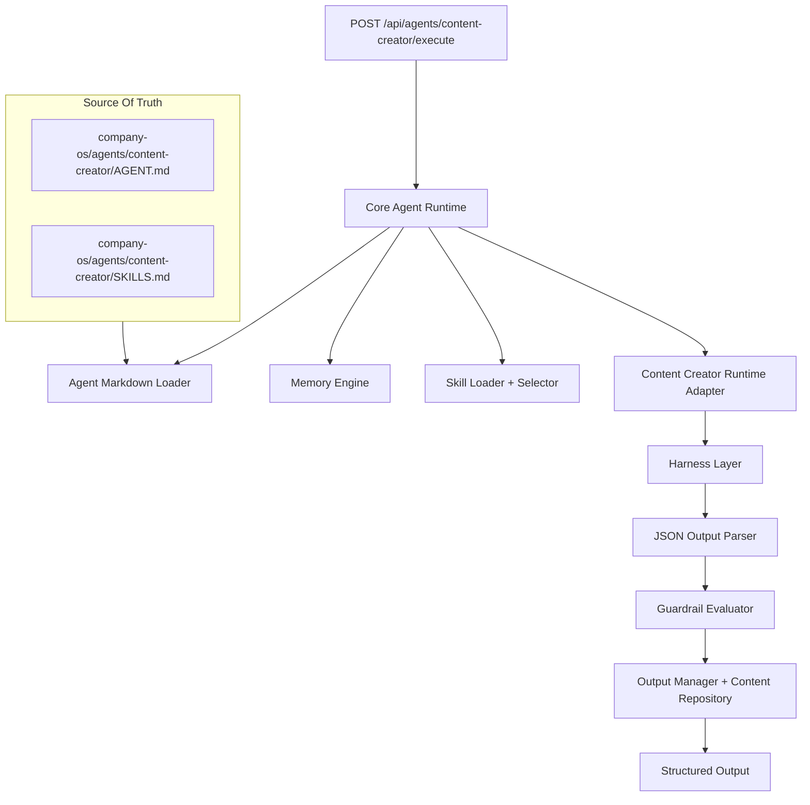

# Content Creator Agent Runtime

This document defines the first production-ready agent pattern for AI Company OS.

The goal is not self-improvement. The goal is a clean execution pipeline that proves the architecture works.

## Architecture



## Runtime Flow

1. Load `AGENT.md`
2. Load `SKILLS.md`
3. Retrieve runtime memory
4. Select relevant skills through the Content Creator adapter
5. Execute workflow through Core Agent Runtime
6. Execute harness tools
7. Parse JSON output
8. Apply guardrails
9. Save generic runtime run/events
10. Save Content Creator task history and learning notes
11. Return structured output

## Harness Tools

- OpenAI API: used when `OPENAI_API_KEY` is configured
- File system: used to read `AGENT.md`, `SKILLS.md`, and `ARCHITECTURE.md`
- Memory retrieval: uses Supabase when configured, otherwise sample memory fallback
- Web search abstraction: currently registered as unavailable in result status
- JSON output parser: normalizes model or fallback output

## API

`POST /api/agents/content-creator/execute`

Input:

```json
{
  "organizationId": "uuid",
  "brief": "Create TikTok content for ...",
  "productName": "Product",
  "targetAudience": "Audience",
  "channel": "tiktok",
  "contentGoal": "engagement",
  "tone": "friendly",
  "constraints": []
}
```

Output includes:

- agent markdown profile
- runtime flow
- selected skills
- memory context
- harness status
- structured content output
- guardrail report
- task history persistence status
- learning note persistence status

## Implementation Plan

### Done

- Core Agent Runtime integration
- Markdown source loading
- Skill selection
- Harness abstraction
- OpenAI API path with deterministic fallback
- JSON parser
- Memory retrieval
- Guardrails
- Task history repository
- Learning notes repository
- Execution API

### Next

- Wire existing `/content` UI to new endpoint
- Replace sample memory fallback with pgvector retrieval
- Add tests for guardrails and skill selection
- Add generated Supabase types after migrations run
- Add model output schema validation when dependencies are available
