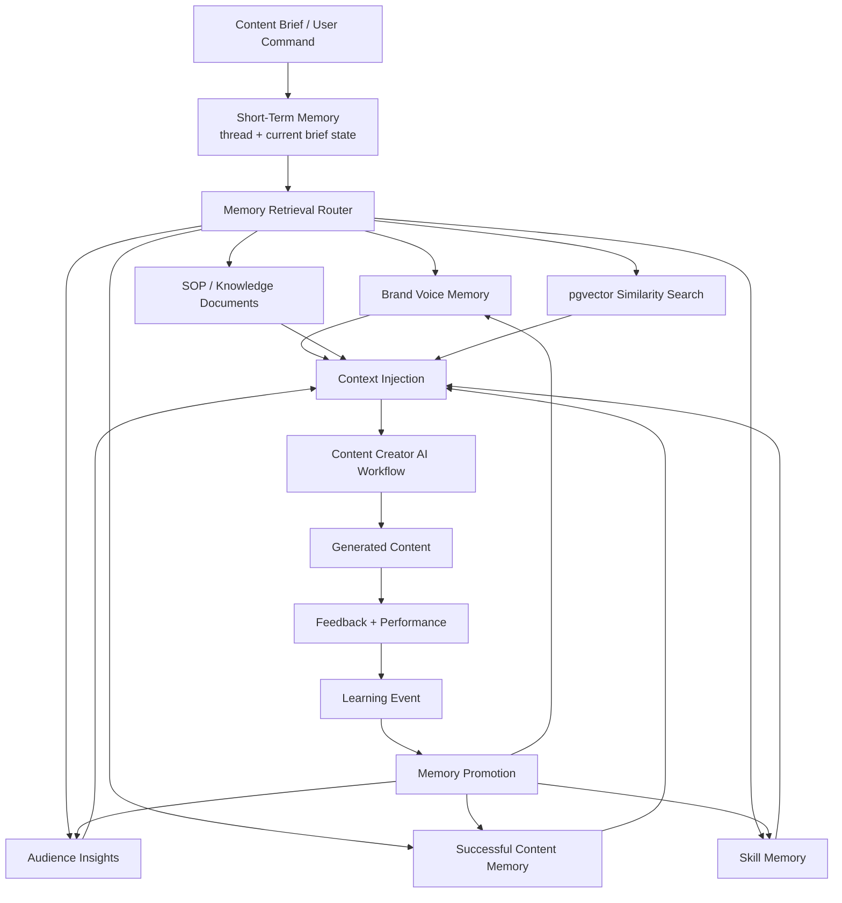
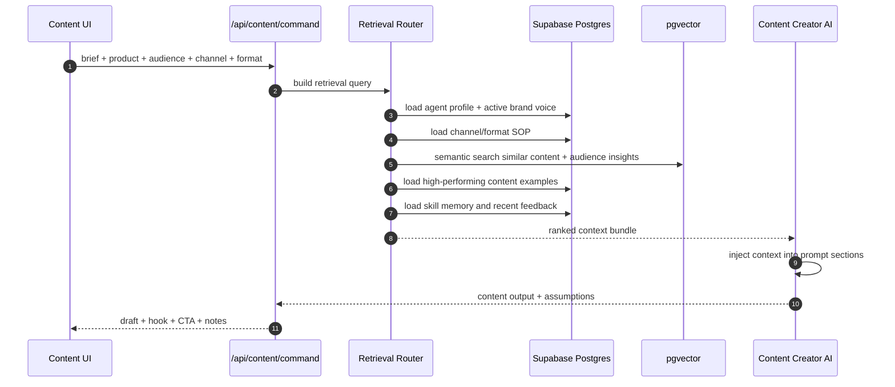

# Content Creator AI Memory Architecture

ระบบ memory ของ `Content Creator AI` ต้องช่วยให้ Agent เขียนคอนเทนต์ได้ดีขึ้นเรื่อย ๆ จาก brand voice, ผลงานที่สำเร็จ, audience insight, feedback และ skill improvement โดยใช้ Supabase Postgres + pgvector เป็นแกนกลาง

## Memory Layers



## Database Tables

ใช้ตาราง existing เป็นฐาน:

- `memory_items`: long-term memory พร้อม embedding
- `knowledge_documents`: SOP, brand guidelines, product docs
- `agent_feedback`: feedback จากผู้ใช้
- `agent_learning_events`: learning loop
- `tasks`: content tasks และ campaign execution
- `reports`: performance summaries
- `skills`, `agent_skill_assignments`: skill memory และ skill growth

เพิ่มตารางเฉพาะ Content Creator AI ใน migration ถัดไป:

### `brand_voice_profiles`

เก็บ brand voice ต่อ organization/brand

Fields:

- `id`
- `organization_id`
- `agent_id`
- `brand_name`
- `voice_traits`: JSON เช่น friendly, premium, educational
- `preferred_words`: คำที่ควรใช้
- `blocked_words`: คำที่ห้ามใช้
- `tone_examples`: ตัวอย่างประโยค
- `compliance_notes`: ข้อควรระวัง
- `embedding vector(1536)`
- `created_at`, `updated_at`

### `content_assets`

เก็บคอนเทนต์ที่ Agent สร้างหรือผู้ใช้นำไปใช้จริง

Fields:

- `id`
- `organization_id`
- `agent_id`
- `task_id`
- `title`
- `channel`: facebook, instagram, tiktok, line, website
- `format`: social_post, short_video_script, campaign_ideas, content_calendar
- `hook`
- `draft`
- `cta`
- `hashtags`
- `metadata`
- `embedding vector(1536)`
- `created_at`

### `content_performance`

เก็บผลลัพธ์ของคอนเทนต์

Fields:

- `id`
- `organization_id`
- `content_asset_id`
- `channel`
- `impressions`
- `reach`
- `engagements`
- `clicks`
- `leads`
- `conversions`
- `revenue`
- `performance_score`
- `observed_at`

### `audience_insights`

เก็บ insight ของกลุ่มเป้าหมาย

Fields:

- `id`
- `organization_id`
- `agent_id`
- `segment_name`
- `pain_points`
- `desires`
- `objections`
- `language_style`
- `buying_triggers`
- `content_preferences`
- `source`
- `confidence`
- `embedding vector(1536)`
- `created_at`, `updated_at`

### `content_feedback_events`

เก็บ feedback ระดับ content

Fields:

- `id`
- `organization_id`
- `content_asset_id`
- `agent_id`
- `rating`
- `feedback_type`: approved, rejected, edited, high_performance, low_performance
- `comment`
- `edited_version`
- `learning_summary`
- `created_at`

## Embeddings Strategy

ใช้ embedding แยกตาม memory type เพื่อ retrieval แม่นกว่าโยนทุกอย่างเป็นก้อนเดียว

### What To Embed

- `memory_items.content`
- `knowledge_documents.title + content`
- `brand_voice_profiles.brand_name + voice_traits + tone_examples + compliance_notes`
- `content_assets.title + hook + draft + cta + hashtags`
- `audience_insights.segment_name + pain_points + desires + objections + language_style`
- `content_feedback_events.learning_summary + edited_version`

### Embedding Dimension

ใช้ `vector(1536)` เป็น default ใน schema ปัจจุบัน เพื่อเข้ากับ embedding model ขนาดกลางและ migration ที่มีอยู่แล้ว

### Chunking Rules

- Brand voice: chunk ตาม voice rule หรือ example
- SOP: chunk 400-800 tokens ต่อ section
- Content asset: embed ทั้งชิ้นถ้าสั้น, แยก hook/body/CTA ถ้ายาว
- Audience insight: 1 segment ต่อ embedding
- Feedback: 1 feedback summary ต่อ embedding

### Metadata Required

ทุก embedding record ควรมี metadata:

- `memory_scope`: brand, audience, content, skill, sop, feedback
- `agent_id`
- `channel`
- `format`
- `brand_name`
- `confidence`
- `importance`
- `source`
- `created_at`

## Retrieval Flow



Retrieval steps:

1. Normalize brief, product, audience, channel, format
2. Load Content Creator AI profile
3. Fetch active `brand_voice_profiles`
4. Fetch SOP from `knowledge_documents`
5. Vector search:
   - similar successful content
   - audience insights
   - relevant feedback summaries
   - long-term memory
6. Rank by similarity + importance + recency + performance
7. Compress context into prompt-safe sections
8. Inject context into agent workflow

## Memory Prioritization

Priority score:

```txt
priority =
  semantic_similarity * 0.35
  + importance * 0.20
  + performance_score * 0.20
  + recency_score * 0.10
  + brand_match * 0.10
  + feedback_confidence * 0.05
```

Rules:

- Brand voice and compliance rules always outrank style preferences
- High-performing content outranks old generic examples
- Recent negative feedback should be injected when channel/format matches
- Audience insights with low confidence can be used only as assumptions
- Duplicate memories should be merged or suppressed
- Memory older than a configured threshold should decay unless repeatedly validated

## Context Injection System

Agent prompt should receive structured context, not a raw blob

Recommended context shape:

```ts
type ContentMemoryContext = {
  brandVoice: {
    traits: string[];
    preferredWords: string[];
    blockedWords: string[];
    examples: string[];
    complianceNotes: string[];
  };
  audienceInsights: {
    segment: string;
    painPoints: string[];
    desires: string[];
    objections: string[];
    languageStyle: string;
  }[];
  successfulExamples: {
    channel: string;
    format: string;
    hook: string;
    draftExcerpt: string;
    cta: string;
    performanceScore: number;
  }[];
  skillMemory: {
    skill: string;
    proficiency: number;
    learningGoal?: string;
    evidence: string[];
  }[];
  feedbackLessons: string[];
  sopRules: string[];
};
```

Prompt section order:

1. Agent identity and Thai-first behavior
2. User brief
3. Brand voice rules
4. Compliance and blocked claims
5. Audience insights
6. Successful examples
7. Feedback lessons
8. Output format requirements

## Feedback Loop

Feedback sources:

- User rating
- User edited content
- Approved/rejected status
- Performance data from social/ad channels
- Manual notes from marketing team

Loop:

1. Save generated content in `content_assets`
2. Save user reaction in `content_feedback_events`
3. Save metrics in `content_performance`
4. Create `agent_learning_events`
5. Promote repeated lessons to:
   - `memory_items`
   - `brand_voice_profiles`
   - `audience_insights`
   - `agent_skill_assignments.evidence`
6. Use promoted memory in future retrieval

## Future Scalability

### MVP

- Supabase Postgres + pgvector
- Single Content Creator AI
- Synchronous API calls
- Deterministic workflow fallback
- Manual performance entry

### v1 Production

- Background job for embeddings
- Dedicated retrieval service module
- Hybrid search: full-text + vector
- Memory deduplication
- Performance scoring
- Prompt/version tracking

### v2 Multi-Agent

- Marketing AI sends campaign strategy to Content Creator AI
- Ads Performance AI writes performance insights back to memory
- CEO AI receives weekly content performance report
- R&D AI contributes product claims and compliance notes

### Scale Limits And Upgrade Path

- Keep pgvector for MVP to mid-scale because RLS, relational data, and memory live together
- Add partial indexes by `organization_id`, `agent_id`, `channel`, and `format`
- Partition large tables later by organization or time if needed
- Move cold content history to cheaper storage while keeping embeddings and summaries
- Add Pinecone or another vector DB only when pgvector latency or index size becomes the bottleneck

## Recommended Next Migration

Create:

- `brand_voice_profiles`
- `content_assets`
- `content_performance`
- `audience_insights`
- `content_feedback_events`

Then add repository modules:

- `src/modules/content/assets-repository.ts`
- `src/modules/content/brand-voice-repository.ts`
- `src/modules/content/audience-insights-repository.ts`
- `src/modules/content/retrieval.ts`
- `src/modules/content/context-builder.ts`
