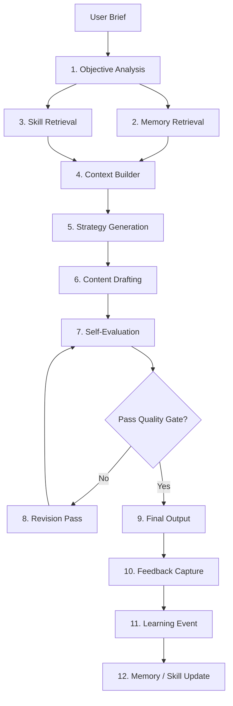
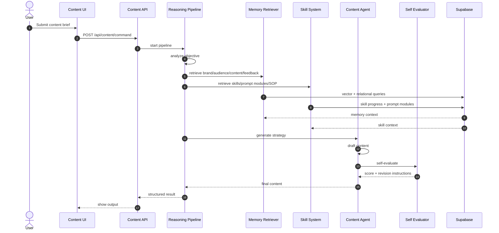

# Content Creator AI Reasoning Pipeline

Reasoning pipeline นี้ออกแบบให้ `Content Creator AI` วิเคราะห์ objective, ดึง memory/skills, สร้าง strategy, generate output, self-evaluate และเรียนรู้จาก feedback อย่างเป็นระบบ

## Reasoning Architecture



## Execution Pipeline

### 1. Objective Analysis

Purpose:

- แยก business objective ออกจาก creative request
- ระบุ audience, channel, format, tone, product, CTA
- ระบุ missing information และ assumptions

Output:

```ts
type ObjectiveAnalysis = {
  businessGoal: string;
  audience: string;
  channel: ContentChannel;
  format: ContentFormat;
  tone: string;
  requiredClaims: string[];
  missingInputs: string[];
  assumptions: string[];
};
```

### 2. Memory Retrieval

Retrieve:

- brand voice memory
- successful content assets
- audience insights
- previous feedback lessons
- SOP / knowledge documents
- long-term memory from `memory_items`

Ranking:

- semantic similarity
- brand/channel/format match
- performance score
- recency
- importance
- feedback confidence

### 3. Skill Retrieval

Retrieve:

- required skills for requested format
- `agent_skill_progress`
- unlocked prompt modules
- skill-level SOP attachments
- recent performance snapshots

Examples:

- Social post: Thai Copywriting, Brand Voice, CTA Writing
- Short video: Hook Writing, Short-form Scriptwriting, Storyboarding
- Content calendar: Content Strategy, Campaign Planning, Audience Segmentation

### 4. Context Builder

Build structured context, not raw text:

```ts
type ContentReasoningContext = {
  objective: ObjectiveAnalysis;
  brandVoice: string[];
  audienceInsights: string[];
  successfulExamples: string[];
  feedbackLessons: string[];
  skillPromptModules: string[];
  sopRules: string[];
};
```

### 5. Strategy Generation

Generate strategy before writing:

- key message
- hook angle
- proof angle
- CTA strategy
- creative structure
- risk/compliance notes

### 6. Content Drafting

Draft according to format:

- `social_post`: hook, body, CTA, hashtags
- `short_video_script`: timestamped scenes
- `campaign_ideas`: campaign concepts and execution notes
- `content_calendar`: daily themes and channel plan

### 7. Self-Evaluation

Evaluate output against rubric:

- objective fit
- audience fit
- brand voice alignment
- clarity
- CTA strength
- channel fit
- compliance risk
- originality
- actionability

Score each 1-5 and compute total score

### 8. Revision Pass

If quality score is below threshold:

- identify weakest rubric dimensions
- revise only the weak sections
- preserve strong sections
- re-run self-evaluation once

### 9. Final Output

Return:

- content title
- hook
- draft
- hashtags
- CTA
- strategy summary
- self-evaluation score
- production notes
- assumptions

### 10-12. Feedback And Learning

After output:

1. Save content asset
2. Capture user feedback
3. Convert feedback to skill impact
4. Create XP event
5. Promote repeated lessons into memory/SOP/prompt module

## Prompt Chains

### Chain A: Objective Analyzer

```txt
You are the objective analyzer for Content Creator AI.
Analyze the user brief and extract:
- business goal
- product/service
- audience
- channel
- format
- tone
- CTA
- missing information
- assumptions
Return structured JSON only.
```

### Chain B: Retrieval Query Builder

```txt
Create retrieval queries for memory and skill lookup.
Use the objective analysis to produce:
- brand voice query
- audience insight query
- successful content query
- feedback lesson query
- SOP query
- skill query
Return compact JSON only.
```

### Chain C: Strategy Generator

```txt
You are Content Creator AI strategy planner.
Using objective, memory, skills, SOP and feedback lessons, create:
- key message
- hook strategy
- proof strategy
- CTA strategy
- channel-specific execution notes
- compliance risks
Do not draft the final content yet.
```

### Chain D: Content Drafter

```txt
You are Content Creator AI.
Write the final content in Thai unless requested otherwise.
Use the approved strategy, brand voice, audience insight, SOP rules and prompt modules.
Output must match the requested format.
Avoid unsupported claims.
```

### Chain E: Self-Evaluator

```txt
Evaluate the draft using this rubric:
- objective fit
- audience fit
- brand voice alignment
- clarity
- CTA strength
- channel fit
- compliance risk
- originality
- actionability
Return scores, weaknesses and revision instructions.
```

### Chain F: Feedback Learner

```txt
Convert user feedback into learning:
- skill impacted
- XP recommendation
- memory candidate
- SOP improvement candidate
- prompt module improvement candidate
Return structured JSON only.
```

## Workflow Diagram



## Quality Gate

Default threshold:

- pass if total score >= 80/100
- revise if any critical dimension is below 3/5
- always revise if compliance risk is high

Critical dimensions:

- objective fit
- brand voice alignment
- compliance risk
- CTA strength

## Future LangGraph Mapping

LangGraph nodes:

- `analyzeObjective`
- `retrieveMemory`
- `retrieveSkills`
- `buildContext`
- `generateStrategy`
- `draftContent`
- `selfEvaluate`
- `reviseIfNeeded`
- `persistOutput`
- `learnFromFeedback`

Edges:

- `selfEvaluate -> reviseIfNeeded` when score below threshold
- `selfEvaluate -> persistOutput` when score passes
- `learnFromFeedback -> memoryUpdate`
- `learnFromFeedback -> skillXpUpdate`
