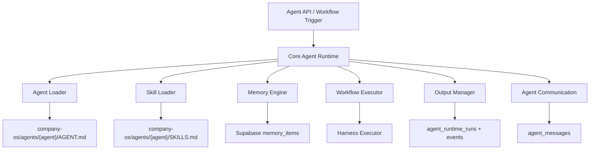

# Core Agent Runtime

The Core Agent Runtime is the execution foundation for AI Company OS agents.

It is not a chatbot runtime. It is a typed workforce execution pipeline that loads an agent, loads skills, retrieves memory, executes a workflow, calls harness tools, validates output, persists logs, and prepares agent communication.

## Runtime Architecture



## Folder Structure

```txt
src/modules/agent-runtime/
  contracts.ts          typed runtime contracts
  agent-loader.ts       loads AGENT.md and role metadata
  skill-loader.ts       loads SKILLS.md and parses skill sections
  memory-engine.ts      retrieves and ranks runtime memory context
  workflow-executor.ts  executes workflow adapters
  harness-executor.ts   calls OpenAI/JSON parser and records tool status
  output-manager.ts     saves runtime runs, events, outputs, learnings
  communication.ts      sends agent-to-agent messages
  runtime.ts            orchestration entrypoint
  skills/               executable skill engine
  logs/                 skill execution logging
```

Content Creator is the reference implementation:

```txt
src/modules/content-creator-agent/
  runtime-adapter.ts
  pipeline.ts
```

## Interfaces And Contracts

- `AgentRuntimeInput<TPayload>`: normalized task request for any agent.
- `AgentRuntimeProfile`: parsed profile from `AGENT.md`.
- `AgentSkillDefinition`: parsed skill SOP/workflow/input/output/guardrail sections.
- `AgentRuntimeMemoryContext`: company, agent, workflow, decision, and injected memory.
- `AgentWorkflowAdapter<TPayload, TOutput>`: agent-specific workflow plug-in.
- `HarnessToolStatus`: trace of tools used, skipped, unavailable, or fallback.
- `AgentRuntimeResult<TPayload, TOutput>`: complete execution result.

## Execution Lifecycle

1. Runtime receives normalized `AgentRuntimeInput`.
2. Agent Loader loads `AGENT.md` and optional `ARCHITECTURE.md`.
3. Skill Loader loads `SKILLS.md` and parses skill definitions.
4. Memory Engine retrieves company memory, agent memory, workflow history, and decision memory.
5. Workflow Adapter selects skills for the current task.
6. Workflow Executor runs the agent-specific workflow.
7. Harness Executor calls tools such as OpenAI and JSON parser.
8. Adapter validates output against guardrails.
9. Output Manager saves runtime run, events, output, and learning note.
10. Communication layer can send messages to other agents.

## State Flow

```txt
agent_loaded
skills_loaded
memory_retrieved
workflow_started
harness_executed
output_validated
output_saved
completed
```

Failure handling is intentionally minimal for this first implementation. Future workflow retries and escalation should live in the Workflow Layer, not inside every agent.

## Database Schema

Migration:

- `supabase/migrations/202605070010_core_agent_runtime.sql`

Tables:

- `agent_runtime_runs`: normalized run input, output, harness status, guardrail report
- `agent_runtime_events`: execution timeline by layer and state
- `agent_messages`: agent-to-agent communication messages

## Current Reference Agent

The Content Creator Agent now executes through `executeAgentRuntime`.
Its selected skills execute through the Skill Execution Engine before the adapter combines the results into workflow output.

The old endpoint remains stable:

- `POST /api/agents/content-creator/execute`

The agent-specific adapter owns only content logic:

- skill selection
- content generation prompt contract
- content output normalization
- content guardrail mapping
- task summary
- learning note

## TODO Roadmap

- Add unit tests for markdown parsing, skill selection, guardrails, and fallback output.
- Add runtime retry policy after workflow contracts stabilize.
- Add approval checkpoint adapter support.
- Add browser automation harness when the Browser harness is ready.
- Add Python and Node runtime tool adapters with allowlisted commands.
- Add vector-ranked memory retrieval with pgvector.
- Register CEO, CTO, CFO, Marketing, Ads Performance, Video Editor, and R&D as runtime adapters after Content Creator is verified.
- Add real agent message inbox UI.
