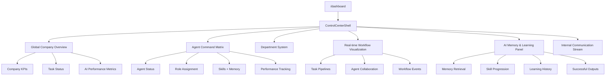
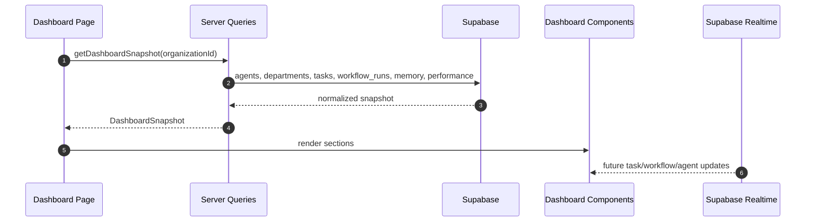

# AI Company OS Main Dashboard UI/UX Architecture

Dashboard หลักต้องให้ความรู้สึกเหมือน control center ของบริษัทที่ขับเคลื่อนด้วย AI: เห็นภาพรวมบริษัท, สถานะ Agent, Workflow ที่กำลังวิ่ง, Memory/Learning และ KPI ในหน้าจอเดียว

## Dashboard Architecture



## Component Hierarchy

```txt
DashboardPage
  ControlCenterShell
    DashboardHero
    CompanyOverviewGrid
      MetricCard
      KPITrendCard
      TaskStatusCard
    AgentCommandMatrix
      AgentStatusCard
      AgentActionBar
    DepartmentGrid
      DepartmentCard
    WorkflowVisualization
      WorkflowLane
      WorkflowNode
      CollaborationEvent
    MemoryLearningPanel
      MemoryRetrievalCard
      SkillProgressCard
      LearningHistoryList
      SuccessfulOutputList
```

## State Management

MVP state approach:

- Server components load dashboard snapshot from Supabase repositories
- Client components only handle UI interactions such as filters, tabs, hover states, and create/edit modals
- Real-time updates later use Supabase Realtime channels:
  - `tasks`
  - `workflow_runs`
  - `messages`
  - `agent_skill_progress`
  - `memory_items`

Recommended state split:

- URL/search params: selected department, selected agent, workflow filter
- Server state: dashboard KPIs, agents, tasks, workflows, memory
- Client state: expanded cards, active tab, modal state
- Background state: running workflows and Agent heartbeats

## Data Flow



## UI Direction

- Theme: dark mode first
- Style: premium SaaS, glassmorphism, AI operating system aesthetic
- Layout: dense but breathable control center
- Cards: modular, 8px radius, translucent surfaces, subtle borders
- Color system: near-black background, blue/cyan intelligence accents, emerald for healthy status, amber for warnings
- Responsiveness: 3-column desktop, 2-column tablet, single-column mobile

## Main Dashboard Sections

1. Global overview:
   - active agents
   - departments
   - active workflows
   - task status
   - company KPIs
   - AI performance metrics

2. Agent management:
   - create/edit agents
   - assign roles
   - monitor status
   - view memory
   - view skills
   - performance tracking

3. Department system:
   - CEO Office
   - Marketing
   - Content
   - Video Production
   - R&D
   - Finance
   - Operations

4. Workflow visualization:
   - task pipelines
   - agent collaboration
   - internal communication

5. AI memory and learning:
   - memory retrieval
   - skill progression
   - learning history
   - successful outputs
