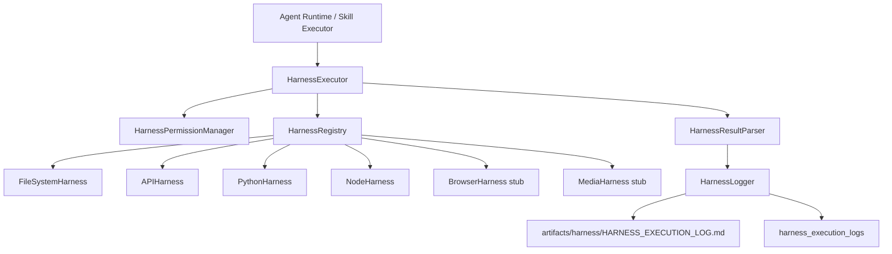

# Harness Execution Layer

The Harness Execution Layer is the executable tool boundary for AI Company OS.

Skill means SOP, workflow logic, instructions, quality checks, and guardrails.
Harness means the real runtime or connector that performs an action.

## Architecture



## Folder Structure

```txt
src/modules/agent-runtime/harness/
  types.ts
  HarnessRegistry.ts
  HarnessExecutor.ts
  HarnessPermissionManager.ts
  HarnessLogger.ts
  HarnessResultParser.ts
  api/APIHarness.ts
  browser/BrowserHarness.ts
  filesystem/FileSystemHarness.ts
  media/MediaHarness.ts
  node/NodeHarness.ts
  python/PythonHarness.ts
```

## Harness Modules

### FileSystem Harness

Active now.

- read files from allowed roots
- write files to `artifacts/` or `memory/`
- create folders in allowed roots

### API Harness

Active now.

- structured HTTP requests
- timeout support
- retry preparation
- output normalization

### Python Harness

Implemented but approval-gated.

- runs approved Python snippets with timeout
- intended for future data analysis and batch jobs

### Node Harness

Implemented but approval-gated.

- runs approved Node.js snippets with timeout
- intended for future utility scripts

### Browser Harness

Stub only.

- future Playwright/Puppeteer automation

### Media Harness

Stub only.

- future image, video, and audio processing

## Permission Boundaries

Current rules:

- File writes are limited to `artifacts/` and `memory/`.
- File reads are limited to `artifacts/`, `memory/`, `company-os/`, and `docs/`.
- Python and Node execution require explicit approval in the harness task.
- Browser and media are not executable yet.
- API calls are structured and logged.

## Test Flow

Task:

```txt
Generate TikTok campaign hooks for a mother-and-baby product
```

Flow:

1. Content Creator Agent executes Hook Generation Skill.
2. MemoryRetriever injects company and Content Creator memory.
3. SkillExecutor generates structured hooks.
4. HarnessExecutor routes a filesystem write task.
5. FileSystemHarness saves output to `artifacts/content-creator/*.json`.
6. HarnessLogger writes `artifacts/harness/HARNESS_EXECUTION_LOG.md`.
7. MemoryWriter saves task history and agent learning notes.

Sample helper:

- `src/modules/agent-runtime/harness/sample-content-artifact-flow.ts`

## Persistence

Migration:

- `supabase/migrations/202605080001_harness_execution_layer.sql`

Table:

- `harness_execution_logs`

## Next Step

Run migrations and add tests for:

- permission checks
- filesystem path boundaries
- API retry behavior
- Python/Node denied-by-default behavior
- Content Creator artifact save path
