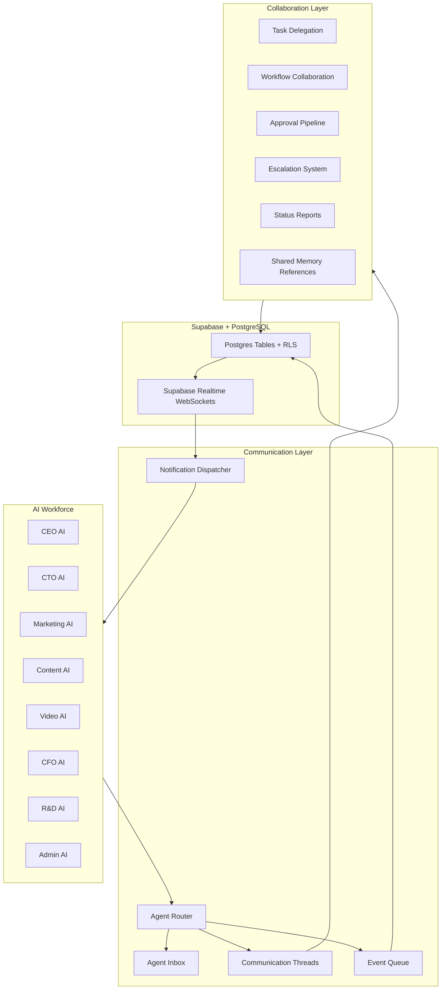
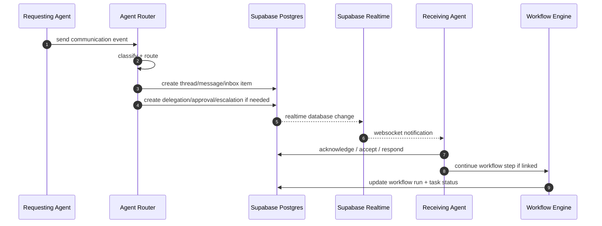

# AI Company OS Internal Communication Architecture

ระบบนี้ทำให้ AI agents ทำงานเหมือนองค์กรจริง: คุยกัน, มอบหมายงาน, ขออนุมัติ, escalate ปัญหา, แชร์ memory, ส่งรายงาน และประสานงานข้ามแผนกแบบ asynchronous + realtime

## Architecture Overview



## Communication Types

1. Direct messaging: Agent-to-agent or user-to-agent message inside a thread
2. Task delegation: one Agent assigns a task to another Agent with acceptance/status
3. Workflow collaboration: Agents coordinate on workflow runs and steps
4. Team discussions: department or project-level discussion threads
5. Status reporting: periodic or event-driven progress reports
6. Approval requests: formal approval pipeline for sensitive decisions
7. Escalation system: raise blocked/high-risk issues to manager Agent or human
8. Shared memory references: attach memory/SOP/report references to messages and tasks

## Agent Routing Logic

Routing inputs:

- message type
- requested department
- required skill
- priority
- workflow context
- escalation level
- target agent if specified
- department ownership

Routing rules:

- CEO AI receives strategic escalations, cross-department conflicts, and final approvals
- CTO AI receives technical architecture, automation, integrations, and reliability issues
- Marketing AI receives campaign, audience, positioning, and growth requests
- Content AI receives content drafts, scripts, calendars, and creative copy
- Video AI receives video production, editing, and asset requests
- CFO AI receives budget, pricing, cost, and financial reporting requests
- R&D AI receives product research, claims, experiments, and innovation requests
- Admin AI receives documentation, scheduling, filing, and operational coordination

## Event Flow



## Message Queues

MVP queue:

- PostgreSQL table `communication_events`
- status: queued, processing, completed, failed, cancelled
- polled by Next.js route handlers or future background worker
- broadcast by Supabase Realtime

Production queue upgrade:

- Supabase table remains audit source of truth
- background worker handles retries, scheduled reports, and long-running workflows
- optional external queue only when throughput requires it

## Workflow Engine

Workflow collaboration uses:

- `workflow_runs`: execution instance
- `workflow_steps`: graph nodes
- `workflow_step_edges`: routing edges
- `workflow_collaborators`: Agents participating in a run
- `workflow_step_messages`: discussions tied to workflow steps
- `agent_task_delegations`: delegated work linked to workflow run/task

LangGraph mapping:

- Node can emit communication event
- Router creates inbox item for target Agent
- Receiving Agent response resumes graph
- Approval node pauses graph until approval decision
- Escalation node routes to supervisor/human

## Communication Protocol

All communication events should follow this shape:

```ts
type AgentCommunicationEnvelope = {
  organizationId: string;
  type:
    | "direct_message"
    | "task_delegation"
    | "workflow_collaboration"
    | "team_discussion"
    | "status_report"
    | "approval_request"
    | "escalation"
    | "memory_reference";
  senderAgentId?: string;
  recipientAgentId?: string;
  departmentId?: string;
  threadId?: string;
  workflowRunId?: string;
  taskId?: string;
  priority: "low" | "medium" | "high" | "critical";
  subject: string;
  body: string;
  memoryReferences?: string[];
  metadata?: Record<string, unknown>;
};
```

## Notification System

Notification channels:

- in-app inbox
- realtime websocket event
- future email/LINE/Slack adapters

Notification priority:

- critical escalation
- approval request
- blocked task
- direct mention
- workflow handoff
- status report

## Implementation Roadmap

1. Add communication schema and RLS
2. Add TypeScript communication types
3. Add router module with deterministic routing rules
4. Add repository functions for threads, events, inbox, delegations, approvals
5. Add Next.js API endpoint `POST /api/communications/events`
6. Add realtime subscription client for dashboard inbox
7. Connect LangGraph nodes to communication router
8. Add approval pipeline UI and escalation dashboard
9. Add notification preferences and external adapters
