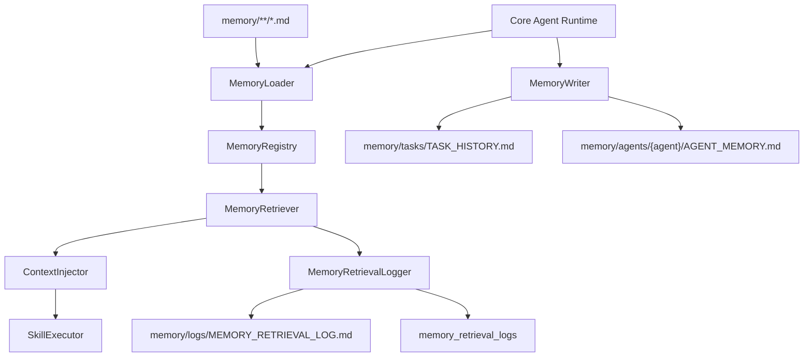

# Memory Retrieval Engine

The Memory Retrieval Engine makes company knowledge, agent memory, task history, decision logs, and workflow memory retrievable and injectable into agent skill execution.

This implementation is file-first and pgvector-ready. It does not build vector search yet.

## Architecture



## Folder Structure

```txt
src/modules/agent-runtime/memory/
  types.ts
  MemoryLoader.ts
  MemoryRegistry.ts
  MemoryRetriever.ts
  ContextInjector.ts
  MemoryWriter.ts
  MemoryRetrievalLogger.ts

memory/company/
  COMPANY_MEMORY.md
  BRAND_VOICE.md
  BUSINESS_GOALS.md

memory/agents/content-creator/
  AGENT_MEMORY.md
  SUCCESSFUL_OUTPUTS.md
  FAILED_OUTPUTS.md

memory/tasks/
  TASK_HISTORY.md

memory/decisions/
  DECISION_LOG.md

memory/workflows/
  WORKFLOW_HISTORY.md
```

## TypeScript Interfaces

Primary contracts:

- `RuntimeMemorySource`
- `RuntimeMemoryRecord`
- `MemoryRetrievalQuery`
- `RankedMemoryRecord`
- `InjectedMemoryContext`
- `MemoryWriteInput`

Defined in:

- `src/modules/agent-runtime/memory/types.ts`

## Retrieval Flow

1. Runtime receives a task objective.
2. `MemoryLoader` loads markdown memory files.
3. `MemoryRegistry` categorizes records by company, agent, task history, decision log, and workflow.
4. `MemoryRetriever` performs keyword retrieval and ranks by relevance, importance, agent match, and workflow match.
5. `ContextInjector` limits context size and converts records into runtime memory items.
6. `SkillExecutor` receives injected memory in the skill execution input.
7. `MemoryRetrievalLogger` records what memory was retrieved.
8. `MemoryWriter` saves task history and useful learning notes after completion.

## Content Creator Test Case

Task:

```txt
Generate 10 TikTok hooks for a mother-and-baby product.
```

Expected retrieval:

- Company memory about draft-only outputs and claim safety.
- Brand voice memory about warm, practical, low-pressure language.
- Content Creator memory about mother-and-baby audience reassurance.
- Successful hook patterns from Content Creator memory.
- Task history about avoiding unsupported health or safety claims.
- Decision log explaining why memory starts file-based.

Injected skill:

- `hook_generation`

Expected result:

- Hooks use reassurance and checklist framing.
- Guardrails avoid guaranteed health, safety, or performance claims.
- Task history and agent learning files receive appended entries after workflow completion.

## Future pgvector Path

The file memory records map cleanly to future database fields:

- source/category -> memory type/scope
- content -> text body
- tags -> filter metadata
- importance -> ranking boost
- embedding -> future pgvector column

When pgvector is added, `MemoryRetriever` should add semantic scores while keeping keyword ranking as fallback.
