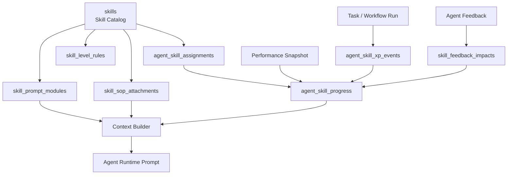

# Modular AI Skill System

ระบบ skill ทำให้ Agent ค่อย ๆ เชี่ยวชาญเฉพาะด้านจากงานจริง, feedback, SOP, prompt modules และ performance score

## Architecture



## Database Tables

- `skills`: skill catalog ระดับองค์กร
- `skill_prerequisites`: skill tree และ dependency
- `agent_skill_assignments`: skill ที่ Agent มีและ learning goal
- `skill_level_rules`: XP และ requirement สำหรับ level 1-10
- `agent_skill_xp_events`: ledger ของ XP ที่เพิ่ม/ลดจาก task, feedback, performance, eval
- `agent_skill_progress`: current level, current XP, specialization score, success/failure counts
- `prompt_modules`: reusable prompt modules เช่น style, rubric, examples, constraints
- `skill_prompt_modules`: ผูก skill กับ prompt module ตาม min level และ priority
- `skill_sop_attachments`: ผูก SOP กับ skill ตาม min level
- `agent_skill_performance_snapshots`: score รายช่วงเวลา
- `skill_feedback_impacts`: แปลง feedback เป็นผลกระทบต่อ skill และ prompt/SOP suggestion

## Skill Levels

- Level 1-2: beginner, ใช้ prompt module พื้นฐานและ SOP แบบละเอียด
- Level 3-4: operator, ทำงานซ้ำได้และเข้าใจข้อผิดพลาดทั่วไป
- Level 5-6: specialist, ปรับ output ตาม context และ feedback ได้ดี
- Level 7-8: senior specialist, ตัดสินใจเชิงกลยุทธ์ใน skill นั้นได้
- Level 9-10: expert, สร้าง SOP/prompt improvement และสอน Agent อื่นได้

## XP And Learning Progression

XP sources:

- `task_completed`
- `feedback_positive`
- `feedback_negative`
- `content_performance`
- `manual_adjustment`
- `sop_mastery`
- `evaluation`

Flow:

1. Agent ทำ task ด้วย skill หนึ่งหรือหลาย skill
2. ระบบบันทึก result, feedback หรือ performance
3. สร้าง `agent_skill_xp_events`
4. background job รวม XP เข้า `agent_skill_progress`
5. ถ้า XP ถึง threshold และผ่าน requirement จะเลื่อน level
6. level ใหม่ unlock prompt modules และ SOP ที่ซับซ้อนขึ้น

## Feedback-Based Improvement

- Rating สูง: เพิ่ม XP, evidence และ success count
- Rating ต่ำ: สร้าง learning summary และแนะนำ prompt/SOP update
- Edited output: ใช้เป็น example module หรือ feedback lesson
- Repeated feedback: promote เป็น SOP หรือ prompt module ใหม่

## Reusable Prompt Modules

Prompt module types:

- `instruction`: วิธีคิดหรือขั้นตอน
- `style`: tone, brand voice, writing style
- `constraint`: ข้อห้าม เช่น compliance หรือ blocked claims
- `example`: ตัวอย่าง output ที่ดี
- `rubric`: เกณฑ์ประเมิน
- `tool_policy`: เงื่อนไขการใช้ tool

Context builder เลือก module จาก required skills, current skill level, priority, metadata และ SOP ที่เกี่ยวข้อง

## SOP Attachment System

SOP attach ได้ 2 ระดับ:

- Agent-level: `agent_sops`
- Skill-level: `skill_sop_attachments`

Skill-level SOP ทำให้ Agent หลายตัว reuse SOP เดียวกันได้ เช่น `Thai Copywriting` ใช้ SOP เรื่องข้อกำหนดการเขียนโฆษณาสมุนไพร

## Performance Scoring

```txt
skill_performance_score =
  success_rate * 0.30
  + average_feedback_score * 20 * 0.25
  + task_completion_quality * 0.20
  + business_metric_score * 0.15
  + sop_compliance_score * 0.10
```

```txt
specialization_score =
  current_level * 10
  + log(current_xp + 1)
  + successful_runs * 0.25
  - failed_runs * 0.5
```

## Specialization Over Time

Agents become more specialized because:

- XP accumulates only from tasks using specific skills
- Better feedback increases skill level faster
- High performance unlocks stronger prompt modules
- Repeated mistakes create targeted learning events
- SOP/prompt modules become more specific per skill
- Supervisor agents can route tasks to agents with higher specialization score
