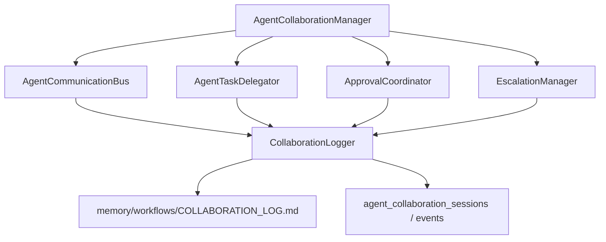
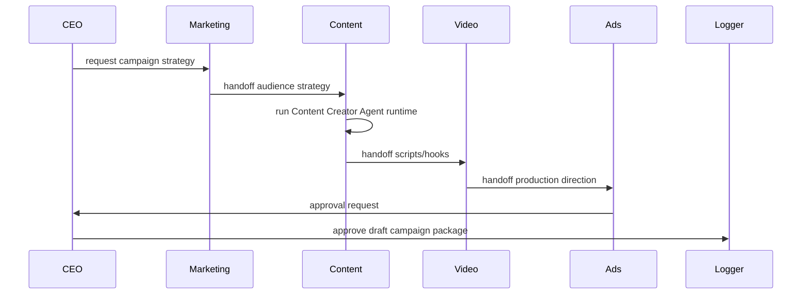

# Multi-Agent Collaboration Layer

The Multi-Agent Collaboration Layer lets AI agents coordinate work like departments in a company.

This layer does not create full autonomy. It provides communication, delegation, handoffs, approvals, escalations, shared memory references, and collaboration logs.

## Architecture



## Communication Model

Objects:

- `AgentMessage`
- `AgentTaskDelegation`
- `CollaborationApprovalRequest`
- `CollaborationEscalation`
- `CollaborationEvent`
- `CollaborationMemoryReference`
- `CollaborationWorkflowContext`
- `CollaborationSession`

Defined in:

- `src/modules/agent-runtime/collaboration/types.ts`

## Folder Structure

```txt
src/modules/agent-runtime/collaboration/
  types.ts
  AgentCommunicationBus.ts
  AgentTaskDelegator.ts
  AgentCollaborationManager.ts
  ApprovalCoordinator.ts
  EscalationManager.ts
  CollaborationLogger.ts
  sample-mother-baby-campaign.ts
```

## Lifecycle



## Test Flow

Workflow:

```txt
Mother-and-baby TikTok Campaign
```

Steps:

1. CEO AI creates campaign objective.
2. Marketing AI receives strategy task.
3. Content Creator AI receives handoff and runs the real Content Creator runtime.
4. Video Editor AI receives scripts/hooks and creates production notes as structured handoff.
5. Ads Performance AI creates targeting strategy as structured handoff.
6. CEO AI approves the final draft campaign package.
7. All messages, handoffs, approvals, events, and memory references are logged.

Sample implementation:

- `src/modules/agent-runtime/collaboration/sample-mother-baby-campaign.ts`

## Persistence

Migration:

- `supabase/migrations/202605080002_multi_agent_collaboration_layer.sql`

Tables:

- `agent_collaboration_sessions`
- `agent_collaboration_events`

File log:

- `memory/workflows/COLLABORATION_LOG.md`

## Next Step

Run migrations and add tests for:

- direct messaging
- task delegation lifecycle
- approval decisions
- escalation events
- collaboration session snapshots
- memory reference propagation
