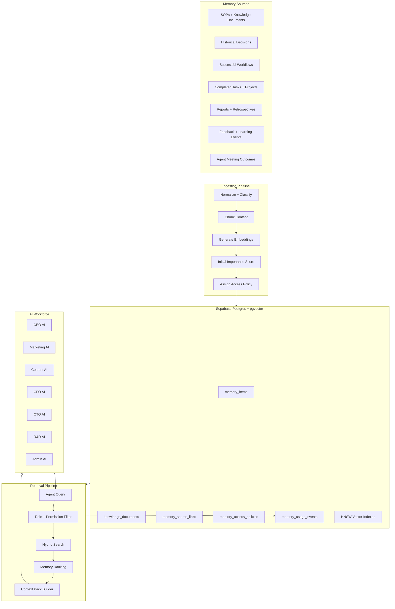
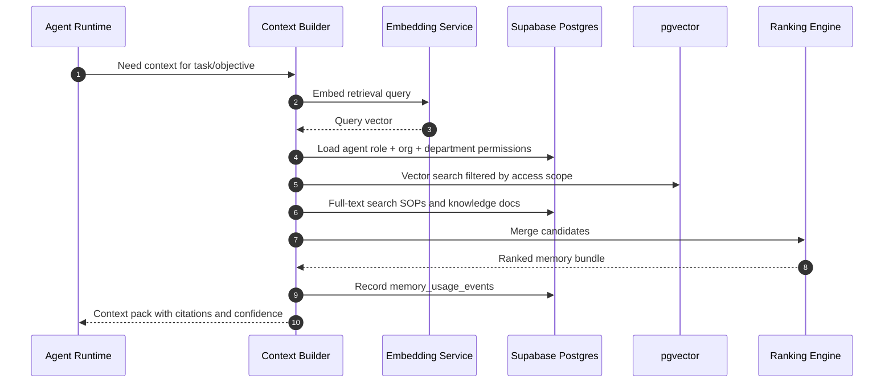
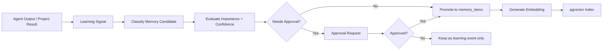

# Shared Organizational Memory System

The Shared Organizational Memory System is the central knowledge layer for AI Company OS. It lets every agent retrieve company knowledge, SOPs, historical decisions, successful workflows, project lessons, reports, and institutional preferences through Supabase, pgvector, and embeddings.

The goal is simple: agents should not restart from zero. They should remember what the company knows, what worked before, what failed before, and what rules must be followed.

## Architecture



## Memory Types

Use the existing `memory_items` table as the long-term memory ledger, with these types:

- `fact`: stable company knowledge, product facts, market facts, operational facts
- `decision`: strategic, financial, technical, marketing, product, or policy decisions
- `preference`: brand voice, owner preferences, company style, operating principles
- `lesson`: what worked or failed in prior tasks, projects, campaigns, or meetings
- `sop_improvement`: proposed or approved improvement to a process
- `report_summary`: compressed summary of reports, retrospectives, and analyses

Recommended metadata fields:

```ts
type MemoryMetadata = {
  scope: "organization" | "department" | "agent" | "project" | "workflow";
  sourceType:
    | "manual_note"
    | "knowledge_document"
    | "agent_meeting"
    | "task_result"
    | "workflow_run"
    | "report"
    | "feedback"
    | "external_import";
  sourceId?: string;
  departmentId?: string;
  projectId?: string;
  workflowId?: string;
  workflowRunId?: string;
  taskId?: string;
  decisionId?: string;
  confidence: number;
  sensitivity: "public" | "internal" | "restricted" | "confidential";
  allowedRoles?: string[];
  blockedRoles?: string[];
  validatedByAgentId?: string;
  validatedByUserId?: string;
  expiresAt?: string;
};
```

## Database Design

Existing foundation:

- `memory_items`: long-term memory with `embedding extensions.vector(1536)`
- `knowledge_documents`: SOPs, manuals, policies, brand docs, product docs
- `agent_sops`: maps agents to SOP documents
- `agent_learning_events`: learning signals from feedback and outcomes
- `tasks`, `workflow_runs`, `reports`: source records for institutional memory

Recommended additions:

### `memory_source_links`

Links memory back to its origin for auditability.

Fields:

- `id`
- `organization_id`
- `memory_item_id`
- `source_type`
- `source_table`
- `source_id`
- `source_excerpt`
- `created_at`

### `memory_access_policies`

Defines role-based access beyond organization RLS.

Fields:

- `id`
- `organization_id`
- `memory_item_id`
- `department_id`
- `agent_role`
- `agent_id`
- `access_level`: `read`, `write`, `promote`, `archive`
- `created_at`

### `memory_usage_events`

Tracks which memories were retrieved, injected, accepted, ignored, or used in outputs.

Fields:

- `id`
- `organization_id`
- `memory_item_id`
- `agent_id`
- `workflow_run_id`
- `task_id`
- `query_text`
- `similarity_score`
- `ranking_score`
- `usage_type`: `retrieved`, `injected`, `cited`, `used`, `ignored`, `rejected`
- `created_at`

### `knowledge_document_chunks`

Makes SOP and large document retrieval precise.

Fields:

- `id`
- `organization_id`
- `knowledge_document_id`
- `chunk_index`
- `heading`
- `content`
- `token_count`
- `metadata`
- `embedding extensions.vector(1536)`
- `created_at`

### `workflow_memory_summaries`

Stores compact learning summaries for successful workflows and previous projects.

Fields:

- `id`
- `organization_id`
- `workflow_id`
- `workflow_run_id`
- `task_id`
- `title`
- `goal`
- `inputs`
- `steps_taken`
- `outputs`
- `success_metrics`
- `lessons`
- `reusable_pattern`
- `failure_modes`
- `embedding extensions.vector(1536)`
- `created_at`

## Embeddings Strategy

Use embeddings for semantic retrieval, but keep relational filters for organization, role, department, memory type, and source.

### What To Embed

- `memory_items.content`
- `knowledge_documents.title + section heading + chunk content`
- `workflow_memory_summaries.title + goal + steps_taken + outputs + reusable_pattern + lessons`
- `reports.title + executive summary + recommendations`
- `task result + task description + lessons + reusable output`
- `meeting summary + decisions + action items + tradeoffs`

### Embedding Model

Current schema uses `vector(1536)`, so default to a 1536-dimension embedding model for MVP compatibility.

If the project later moves to larger embeddings:

- Add a new vector column, for example `embedding_v2 vector(3072)`
- Backfill asynchronously
- Switch retrieval functions by embedding version
- Keep old embeddings during migration

### Chunking Rules

- SOPs: 300-800 tokens per section, preserve heading path
- Decisions: one decision per memory item
- Project lessons: one lesson cluster per memory item
- Workflow summaries: one summary per workflow run, plus optional chunks for long workflows
- Reports: executive summary, findings, recommendations, and metrics as separate chunks
- Meeting outcomes: summary, each decision, each reusable lesson, and action item rationale

## Semantic Retrieval

Retrieval should be hybrid:

1. Full-text search for exact names, SOP titles, product names, and policy terms
2. Vector search for semantic similarity
3. Relational filters for organization, role, department, source, and recency
4. Ranking layer to prioritize useful memory over merely similar memory



## Memory Ranking

Ranking should combine similarity, authority, usefulness, and freshness.

Recommended scoring:

```txt
ranking_score =
  semantic_similarity * 0.35
  + importance_score * 0.18
  + source_authority * 0.14
  + role_relevance * 0.12
  + recency_score * 0.08
  + usage_success_score * 0.08
  + confidence_score * 0.05
```

Definitions:

- `semantic_similarity`: pgvector cosine similarity
- `importance_score`: normalized `memory_items.importance`
- `source_authority`: SOPs, approved decisions, and human-validated memory rank higher
- `role_relevance`: memory tagged for the requesting agent role ranks higher
- `recency_score`: recent memories rank higher unless memory is marked stable
- `usage_success_score`: memory that has helped successful workflows ranks higher
- `confidence_score`: validated or repeatedly confirmed memory ranks higher

Hard ranking rules:

- SOP compliance rules outrank stylistic preferences
- Approved decisions outrank suggestions
- Confidential memory must not be returned to unauthorized roles
- Agent-specific memory can supplement, but organization-level memory remains the default source of truth
- Repeated duplicate memories should be collapsed into one canonical item
- Expired memory should be excluded unless explicitly requested for historical analysis

## Role-Based Memory Access

Use Supabase RLS for organization boundary, then add application-level and database-level role filters for memory sensitivity.

### Access Scopes

- Organization-wide: CEO AI, Admin AI, approved human owners
- Department-level: Marketing AI can access marketing memory; CFO AI can access finance memory
- Agent-level: private agent learning, draft reasoning traces, skill improvement notes
- Project/workflow-level: memory available only to agents assigned to that project or workflow
- Confidential: finance, legal, HR, sensitive strategy, credentials, regulated claims

### Role Rules

- CEO AI can retrieve strategic decisions, cross-department summaries, escalations, and approved reports
- CFO AI can retrieve finance, budget, pricing, cost, and ROI memory
- CTO AI can retrieve technical architecture, incidents, automation, and integration memory
- Marketing AI can retrieve campaigns, positioning, audiences, brand, and performance memory
- Content AI can retrieve brand voice, content SOPs, successful content, and audience insights
- R&D AI can retrieve product claims, experiments, research notes, and compliance constraints
- Admin AI can retrieve operational SOPs, documents, schedules, and filing procedures

## Context Pack Contract

Agents should receive structured memory, not a raw list of search results.

```ts
type OrganizationalMemoryContext = {
  objective: string;
  retrievedAt: string;
  agentRole: string;
  companyKnowledge: MemoryCitation[];
  relevantSops: MemoryCitation[];
  historicalDecisions: MemoryCitation[];
  successfulWorkflows: MemoryCitation[];
  projectLessons: MemoryCitation[];
  warnings: MemoryCitation[];
  assumptions: string[];
};

type MemoryCitation = {
  id: string;
  sourceType: string;
  title?: string;
  excerpt: string;
  relevanceScore: number;
  confidence: number;
  sensitivity: string;
  reasonIncluded: string;
};
```

Prompt injection order:

1. Current objective/task
2. Hard SOPs and compliance constraints
3. Historical decisions
4. Company facts and preferences
5. Successful workflow patterns
6. Project lessons and warnings
7. Output requirements

## Memory Write Flow

Agents should not write everything directly into long-term memory. The system should separate signals from promoted memory.



Promotion rules:

- Human-approved decisions become `memory_type = decision`
- Repeated project lessons become `memory_type = lesson`
- Stable company preferences become `memory_type = preference`
- SOP changes become `memory_type = sop_improvement` until approved into `knowledge_documents`
- Meeting summaries become `memory_type = report_summary`

## Scalable Architecture

### MVP

- Supabase Postgres stores relational memory and access policies
- pgvector HNSW indexes support semantic retrieval
- Embeddings generated synchronously for small writes
- Retrieval is implemented in `src/modules/memory`
- Context builder is called by API routes and deterministic workflows

### Production v1

- Background job queue for embedding generation and backfills
- Dedicated `knowledge_document_chunks` table for SOP retrieval
- SQL RPC functions for vector search with access filters
- Memory usage tracking and ranking feedback
- Memory deduplication and canonical memory promotion
- Realtime updates for newly promoted memory

### Production v2

- Hybrid search with full-text, vector, and reranking model
- Separate embedding versions for migration safety
- Table partitioning for large organizations or high-volume workflow logs
- Cold storage for raw artifacts, keeping summaries and embeddings hot
- Optional external vector database only if pgvector latency or index scale becomes the real bottleneck

## Recommended Supabase RPC

Create an RPC like:

```sql
match_organizational_memory(
  query_embedding vector(1536),
  target_organization_id uuid,
  requesting_agent_id uuid,
  requesting_role text,
  memory_types text[],
  match_count int
)
```

The function should:

- Filter by `organization_id`
- Filter by memory sensitivity and access policies
- Search `memory_items.embedding`
- Optionally union `knowledge_document_chunks.embedding`
- Return similarity, metadata, source type, and access reason

## Implementation Plan

### Phase 1: Schema

- Add `memory_source_links`
- Add `memory_access_policies`
- Add `memory_usage_events`
- Add `knowledge_document_chunks`
- Add `workflow_memory_summaries`
- Add vector indexes for chunk and workflow summary tables
- Add RLS policies using `public.is_org_member(organization_id)`

### Phase 2: Embedding Service

- Add `src/modules/memory/embeddings.ts`
- Support embedding text normalization
- Support batching
- Store embedding model/version in metadata
- Add retry-safe backfill script

### Phase 3: Retrieval Module

- Add `src/modules/memory/retrieval.ts`
- Add role-aware candidate filtering
- Add hybrid search
- Add ranking engine
- Add context pack builder
- Add memory usage logging

### Phase 4: Memory Promotion

- Add memory candidate classifier
- Add confidence and importance evaluation
- Add approval workflow for sensitive memory
- Add promotion from task result, workflow result, meeting decision, report, and user feedback

### Phase 5: Agent Integration

- CEO AI retrieves decisions, reports, goals, and cross-department memory
- Marketing AI retrieves campaign, audience, brand, and performance memory
- Content AI retrieves SOPs, brand voice, successful content, and feedback lessons
- CFO AI retrieves budget, pricing, ROI, and finance decisions
- CTO AI retrieves architecture, incidents, automation patterns, and technical decisions
- Meeting system retrieves shared context before discussion and writes outcomes after completion

### Phase 6: UI

- Add memory explorer
- Add SOP retrieval view
- Add decision history view
- Add successful workflow library
- Add memory promotion queue
- Add memory access and sensitivity controls

## Success Criteria

The system is working when:

- Agents can retrieve relevant SOPs before acting
- Agents cite historical decisions in recommendations
- Successful workflows are reused in similar future projects
- Memory ranking improves based on actual usage
- Sensitive memory is filtered by role and access policy
- Meeting outcomes and project lessons become retrievable company memory
- The system remains organization-scoped and scalable through Supabase, pgvector, and embeddings
