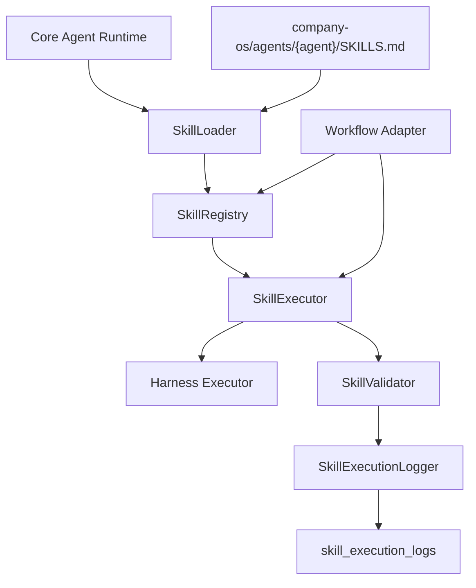

# Skill Execution Engine

The Skill Execution Engine makes `SKILLS.md` loadable, searchable, executable, validated, and logged.

It does not replace harness tools. A skill defines instruction, SOP, workflow logic, quality criteria, and guardrails. A harness performs real work such as model calls, filesystem access, memory retrieval, browser automation, or runtime execution.

## Architecture



## Folder Structure

```txt
src/modules/agent-runtime/skills/
  types.ts
  SkillLoader.ts
  SkillRegistry.ts
  SkillExecutor.ts
  SkillValidator.ts

src/modules/agent-runtime/logs/
  SkillExecutionLogger.ts

company-os/agents/content-creator/
  SKILLS.md

company-os/workflows/content-production/
  WORKFLOW.md
```

The project uses `src/modules/agent-runtime` instead of root-level `src/agent-runtime` to stay consistent with the existing codebase.

## Standard Markdown Skill Schema

Each skill block uses:

- Skill ID
- Purpose
- When To Use
- Required Inputs
- Optional Inputs
- SOP Steps
- Output Schema
- Guardrails
- Quality Checklist
- Failure Modes
- Examples
- Harness Tools Needed
- Memory Usage
- Success Metrics

## TypeScript Interfaces

Primary contracts:

- `SkillDefinition`
- `SkillOutputField`
- `SkillExecutionInput`
- `SkillExecutionResult`
- `SkillValidationResult`

Defined in:

- `src/modules/agent-runtime/skills/types.ts`

## Execution Lifecycle

1. `SkillLoader` reads `SKILLS.md`.
2. Parser converts markdown blocks into `SkillDefinition[]`.
3. `SkillRegistry` registers skills by agent.
4. Workflow adapter searches or selects skill IDs.
5. `SkillExecutor` validates input shape and applies SOP context.
6. Harness executor calls OpenAI/JSON parser or deterministic fallback.
7. `SkillValidator` checks required inputs, output schema, guardrails, and quality checklist.
8. `SkillExecutionLogger` writes the execution record.
9. Workflow adapter combines reusable skill results into workflow output.

## Current Content Creator Skills

- `hook_generation`
- `caption_writing`
- `tiktok_scripting`
- `storytelling`
- `cta_generation`
- `viral_content_analysis`

## Sample Execution

Task:

```txt
Generate 10 TikTok hooks for a mother-and-baby product
```

Path:

```txt
loadSkillsForAgent("content-creator")
createSkillRegistry(...)
registry.get("content-creator", "hook_generation")
executeSkill(...)
saveSkillExecutionLog(...)
```

Sample helper:

- `src/modules/content-creator-agent/sample-skill-execution.ts`

Expected reusable output:

```json
{
  "hooks": ["Before you choose something for your baby, check this first."],
  "hook_rationale": "Hooks focus on reassurance, practical choice, and parent uncertainty.",
  "best_hook": "Before you choose something for your baby, check this first."
}
```

## Database

Migration:

- `supabase/migrations/202605070011_skill_execution_engine.sql`

Table:

- `skill_execution_logs`

## Next Step

Run migrations, then add focused tests for:

- markdown parsing
- skill registry ranking
- required input validation
- output schema validation
- Content Creator hook generation fallback
