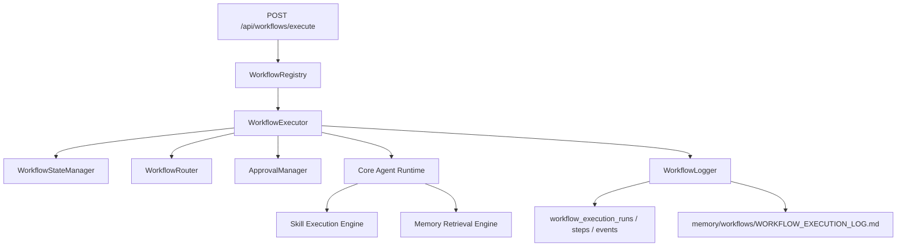

# Workflow Execution Engine

The Workflow Execution Engine coordinates structured company workflows after the Core Agent Runtime, Skill Execution Engine, and Memory Retrieval Engine.

It does not create autonomous company behavior. It executes declared workflow steps, routes tasks to agents, manages state, records approvals, and saves workflow history.

## Architecture



## Folder Structure

```txt
src/modules/agent-runtime/workflows/
  types.ts
  WorkflowRegistry.ts
  WorkflowExecutor.ts
  WorkflowStateManager.ts
  WorkflowRouter.ts
  WorkflowLogger.ts
  ApprovalManager.ts
  sample-content-production.ts

company-os/workflows/
  content-production/WORKFLOW.md
  product-research/WORKFLOW.md
  ads-campaign/WORKFLOW.md
  weekly-business-review/WORKFLOW.md
```

## TypeScript Interfaces

Primary contracts:

- `WorkflowDefinition`
- `WorkflowStepDefinition`
- `WorkflowExecutionInput`
- `WorkflowStepRun`
- `WorkflowExecutionEvent`
- `WorkflowExecutionResult`

Defined in:

- `src/modules/agent-runtime/workflows/types.ts`

## Workflow State Model

Supported states:

- `pending`
- `queued`
- `running`
- `waiting_approval`
- `completed`
- `failed`
- `retrying`
- `cancelled`

State transitions are validated in:

- `WorkflowStateManager.ts`

## Standard WORKFLOW.md Format

Each workflow includes:

- Workflow ID
- Name
- Purpose
- Participating Agents
- Inputs
- Outputs
- Steps
- Approval Points
- Memory Updates
- Success Metrics
- Failure Handling

Step lines use:

```txt
- step_id | Step name | agent_id | step_type | expected output | description
```

## Content Production Workflow

Implemented test flow:

1. Marketing receives campaign brief.
2. Marketing analyzes audience strategy.
3. Content Creator Agent executes the real runtime and selected skills.
4. Video Editor receives a production handoff placeholder.
5. CEO review checkpoint is recorded.
6. Workflow memory and execution logs are saved.

The Content Creator step calls:

- `executeContentCreatorAgent`
- Core Agent Runtime
- Skill Execution Engine
- Memory Retrieval Engine

## API

`POST /api/workflows/execute`

Example:

```json
{
  "organizationId": "sample-organization",
  "workflowId": "content-production",
  "objective": "Generate TikTok content for a mother-and-baby product launch.",
  "payload": {
    "campaignBrief": "Generate 10 TikTok hooks and short-form direction.",
    "productName": "Mother and baby product",
    "targetAudience": "New mothers",
    "channel": "tiktok",
    "contentGoal": "engagement"
  },
  "humanInTheLoop": false
}
```

## Persistence

Migration:

- `supabase/migrations/202605070013_workflow_execution_engine.sql`

Tables:

- `workflow_execution_runs`
- `workflow_execution_steps`
- `workflow_execution_events`

File log:

- `memory/workflows/WORKFLOW_EXECUTION_LOG.md`

## Next Step

Run migrations and add tests for:

- workflow markdown parsing
- state transitions
- approval checkpoint behavior
- content-production execution path
- workflow logging fallback without Supabase
